+++
date = '2026-09-24T14:44:10+08:00'
draft = false
title = '论文笔记：DSec——DeepSeek 的 Agent 沙箱基础设施'
tags = ['LLM Infra', 'Agent Sandbox', 'RL']
+++

> 论文：[DeepSeek Elastic Compute (DSec): A Sandbox Infrastructure for Effective Agentic Training at Scale](https://arxiv.org/pdf/2609.22978v1)

## 写在前面

近半年来，各大模型厂的 LLM 能力不断提升，而后训练和 RL 在这一阶段直接决定了模型在实际任务中的能力，如何保证一个大规模 RL 系统稳定、高效地运行，就是 infra 团队要解决的问题。这篇论文讲了 DeepSeek 内部的沙箱平台 DSec，看完以后发现其实很多思路都是业界最近一段时期普遍的一些做法。

论文里提到，DSec 单个规模单元大概是：
- 大约 160 台 CPU 节点、3 万个核、250 TB 左右内存。
- 每天跑大约 300 万个沙箱，峰值同时存活约 38 万个，峰值创建速度每秒 5000 个以上
- 单机稳定跑过 3200 个容器或 800 个 microVM
- 单个任务最多一次要 3.2 万个沙箱。

这种量级的 Agent 沙箱环境是一般中小型公司接触不到的，而 DeepSeek 团队把这些做法系统化地整理成了这篇技术报告，对于很多基架团队是有一些工程上的借鉴意义的。

### 先看全貌

这篇文章会比较长，所以先把整篇论文的逻辑理一遍，文章后面说的每一部分都挂在这条线上。

论文的主线其实很清楚：先讲 Agent 沙箱这种负载有多特殊，再讲为了承接它搭了一个什么样的平台，然后用生产数据把负载拆成三个具体挑战，每个挑战对应一套核心机制，最后讲平台怎么和 RL 训练框架配合，以及 Agent 在沙箱里作弊的问题怎么防。

对应到我的这篇博文：

- 第一到第二部分是背景和用户视角：为什么 Agentic RL 需要一整个平台以及调用方看到的 DSec 长什么样。
- 第三部分是整体架构：一个沙箱创建请求从 SDK 走到节点上，经过了哪些组件。这部分我会拿 k8s 做对照，两者在组件划分上很像很像，但状态模型又完全不同。
- 第四部分是生产负载分析，我从论文中归纳出三个挑战：环境准备贵、高密度下资源管不住、镜像分发扛不住。
- 第五到第八部分先总后分，针对上面的挑战介绍三套解决办法：可组合环境层、内存与 CPU 的高密度管理、基于 3FS 的镜像按需加载，每套解法后面直接跟它的实验结果。
- 第九到第十部分跳出沙箱本身，讲和 RL 框架的协同，以及 Agent 作弊的案例和防护。
- 最后是我自己的看法。

## 一、 为什么 Agentic RL 需要一整个平台？

### RL 循环里，沙箱在哪

Agentic 模型和普通对话模型的差别在于，它要和环境来回交互：读代码、调工具、跑命令、看报错、改文件，Computer Use 场景下还要操作浏览器和桌面应用。训练这样的模型，只喂静态的输入输出对不够，需要让它在真实的隔离环境里反复试，靠 RL 学。

这里简单说一下，RL 训练是个三段式循环。先是 Rollout，当前模型会在沙箱里干活，产出一条轨迹（行动步骤和结果）；然后算 Reward，用退出码、stdout、测试通过率或者专门的 verifier 打分；最后做策略更新。评测走的路径差不多，只是轨迹拿去衡量能力，不更新参数。

整个流水线里，对沙箱压力最大的是 Rollout 和评测。规模大、并发高，又和训练循环咬得很紧。

现在业界的主流做法还会把生成和策略优化流水线化，也就是异步 Rollout：完成一条就补一条，维持高并发，也缓解长尾拖慢整体的问题。放到 Agent 场景里，这意味着任意时刻都有大量"正在进行中"的有状态沙箱会话，而且这些会话可能因为策略更新或 GPU 抢占被打断，之后还要接着跑。

### Agent 沙箱这种负载有多烦人

论文列了七条负载特性，我归并成几块来说。

- 第一块是量和节奏。

Rollout 和评测是成批创建沙箱的，单个任务最多要 3.2 万个，而且要在很短的窗口里全部就绪，否则训练 batch 用不上。这对调度和镜像分发这类共享服务是很大的考验，任何一个集中式瓶颈都会被打穿（我就说 k8s 在这种场景下绝对是累赘，就拿单纯的 k8s 调度来讲吞吐能达到 5000 Pod/s 都已经很牛了，更别说你这种 RL 场景下还可能有 Gang 调度，还有 kubelet 节点上一堆准入、挂载、镜像启动等等）。

- 第二块是资源画像。

沙箱大部分时间在等 LLM 生成下一步动作，CPU 用得非常少，天然适合超卖，这也是单机能塞几千个的前提。但它又是有状态、长寿命的：比如模型改的文件、装的依赖、起的服务，后面的调用都要用到。CPU 闲下来了，内存、guest page cache、宿主 page cache、可写层还一直占着。按照论文披露的数据，超卖到 Dsec 承载的沙箱密度，常驻开销就成了集群容量的天花板。

- 第三块是多样性。

任务类型从 OJ 脚本、仓库级软件工程、安全任务、Computer Use，一直到 Android 开发环境，对 CPU、内存、依赖、系统功能、隔离强度的要求差别很大，一种沙箱抽象覆盖不了。同一类任务里，每个字任务又可能有自己的仓库、依赖版本、服务和评测脚本，镜像数量极多，复用率很低。论文原文在引言里就提前剧透了一个消融结果：全量拉镜像会让完成时间拉长 1.7 倍，按需加载能少写 57% 的磁盘。

- 第四块是信任和中断。

Agent 的行为不可信，可能搞坏文件系统、耗尽资源、干扰系统组件。GPU 训练任务又随时可能被抢占，长 Rollout 的状态必须保得住。

读到这里我第一反应是拿它和 Serverless 对比，因为表面上都是大量短生命周期的隔离环境。但仔细看一下它们的区别，其实还不太一样：

| 对比维度    | 传统 Serverless    | Agent 沙箱            |
| ------- | ---------------- | ------------------- |
| 生命周期    | 毫秒到秒级            | 中位数十几分钟，p99 超过 3 小时 |
| 状态      | 无状态              | 有状态，后续调用依赖前面的修改     |
| 镜像      | 少量镜像、高复用，常假设已在本地 | 十几万个环境、低复用，单机放不下    |
| 执行代码的来源 | 开发者写的            | 模型实时生成，可能主动找漏洞      |
| 中断      | 函数失败重试即可         | 要跨 GPU 抢占保住进度       |

所以很多云厂商这几年攒下来的 Serverless 冷启动的优化假设，放到这里很多得重新想。DSec 后面的设计，基本就是在回应这张表的右边一栏。

## 二、从调用方看 DSec

### libdsec

在 DSec 实际的生产环境中，是研究员（准确说是训练框架、评测框架这些代码代表研究员）通过 Python SDK 去调用 DSec 来启动沙箱的，这个 SDK 叫 libdsec。

研究员在请求创建沙箱的时候需要填写：

- 沙箱类型（后面可以看到，有很多种不同的沙箱，比如 QEMU、microVM、容器等等）
- 镜像或环境标识
- CPU 和内存上限
- 生命周期参数（比如空闲多久自动停）
- 网络规则（论文示例里是允许访问 PyPI、禁止访问 NPM，粒度细到具体的包镜像源，后面会讲为什么要这么细）
- 初始用户（比如以 root 身份启动）

创建好之后就能跑 shell 命令或工具调用，拿回输出和返回码，用完释放。

这种多沙箱后端的设计我个人觉得是合理的，原因是沙箱上执行的 agent 的任务类型都是不一样的，如果硬抽象成一个类型的沙箱，反倒是丧失了灵活性和可扩展性。

### 四种沙箱后端

沙箱运行时有个绕不开的矛盾：隔离越强、功能越完整，启动越慢、开销越大。而在 DSec 中，他们用了四种沙箱后端来适配不同的服务：
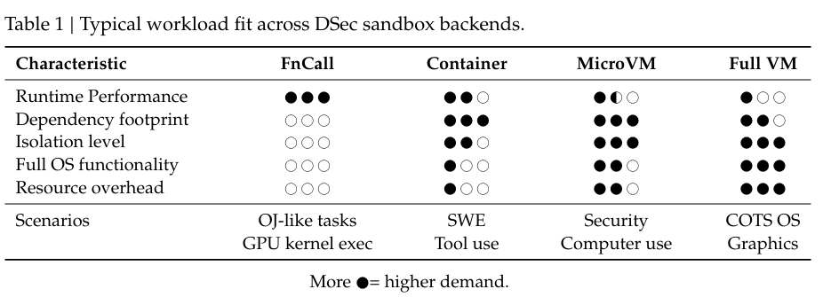

- FnCall 面向短小、无状态的任务：OJ、编译、serverless 程序、GPU kernel、工具脚本。任务跑在预先创建好、可复用的 CPU 或 GPU 容器里，省掉每次调用的开箱成本。GPU 版本有两种模式，共享模式下多个容器共用一个 GPU 实例，适合轻活；独占模式下一个容器在生命周期内独占一个实例，适合算子性能评测这种对干扰敏感的场景。

- 容器是软件工程和通用工具调用的主力，启动快、密度高，能跑绝大多数仓库级任务需要的 Linux 软件栈。短板是和宿主共享内核，安全敏感的任务不合适。

- MicroVM：DSec 用的是 Firecracker，隔离边界更强，又保留 Linux 兼容性，适合安全任务和需要更强租户隔离的场景，代价是内存开销更大、启动更慢（而且不能热插拔，所以业界有些基于 microVM 的沙箱运行时用的是 Cloud-Hypervisor）。

- 完整 VM 覆盖需要商用操作系统的负载，比如用 QEMU 跑 Android，以及需要 GUI 或图形渲染的任务。开销最大，但有些任务离不开特定 OS 的 API 或移动端运行时行为。

论文里面提到，在生产环境里，容器和 microVM 在实例数和资源消耗上都占大头。FnCall 调用量大但常驻环境少，完整 VM 负责一些少见但重要的任务类型。所以论文后面的负载分析和机制设计，主要围绕容器和 microVM。

### 生命周期

不管沙箱后端是哪种，调用方看到的流程都一样：创建时指定环境制品、资源上限、生命周期策略和网络策略；平台准备环境；调用方发命令、看输出、跑测试；最后显式停止，或者 TTL 到期被回收。

"环境制品"因沙箱后端的类型不同而不同。容器和 microVM 是一个基础镜像加上任务专属的 workspace 层和 toolkit 层，由平台现场组装；完整 VM 是准备好的镜像或快照；FnCall 是一份任务描述，包括任务类型、依赖文件和要跑的代码。"分层组装"这个概念后面会展开，它是整篇论文最核心的机制之一。

沙箱在整个生命周期内都是有状态的。改过的文件、装过的依赖、起过的服务会一直留着，后面的命令能看到前面的效果。也正因为这样，CPU 闲了很久，状态还钉在内存里。

### 规模，以及粗略算的一笔账

DSec 部署在多个规模单元上，共享同一套 3FS 分布式文件系统存放基础镜像和 workspace。单个规模单元近 160 台 CPU 节点、3 万核、约 250 TB 内存，管理 PB 级的镜像和层，典型的一天服务约 300 万个沙箱，峰值并发约 38 万，峰值创建速度超过每秒 5000 个。

我拿这几个数算了一下，峰值 38 万个沙箱分到 3 万个核上，那平均每个沙箱不到 0.1 个核。如果按论文 SDK 示例里申请 4 核 4 GB 的规格算，CPU 超卖接近 50 倍。内存这边，250 TB 除以 38 万，每个沙箱平均约 660 MB；按示例的 4 GB 申请算，内存也超卖了 6 倍左右。实际申请规格论文没披露，这个倍数只能看个量级。

再看节奏。一天 300 万个实例，平均每秒约 35 个创建请求，峰值却是每秒 5000 个以上，差了两个数量级。按容器中位寿命 17 分钟左右估，平均并发大概几万量级（长尾会把均值往上拉，所以这里只能说个区间），而峰值是 38 万。这种峰均比说明负载极端突发，也解释了后面为什么要做云上弹性。

## 三、架构：拿 k8s 做个对照

论文中给出了 DSec 的架构图：
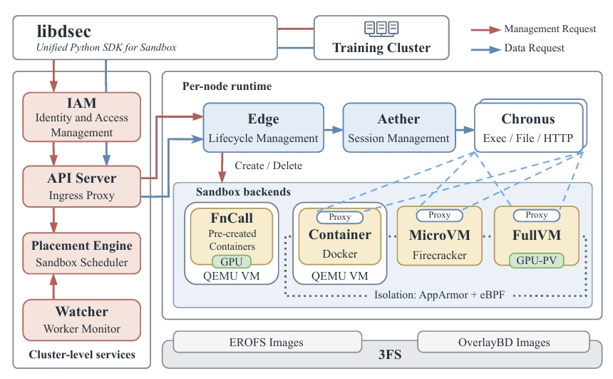

容器和 VM 类沙箱通过每个沙箱一个的代理 aether 与平台其他部分通信；FnCall 走独立执行路径，不经过这个代理。

第一眼看这张图，我的感觉就是：这不就是一个 k8s 吗？有 apiserver，有调度器，每台机器上有个 agent 管本机的沙箱，还能插不同的运行时。所以这一部分我拿 k8s 做参照来讲，大部分读者对 k8s 都熟，对上号以后每个组件的定位会清楚很多。先说明一下：论文全文一次都没有提 k8s，下面的对比全是我自己的解读。

### 整体结构

DSec 的组件分两层。集群级服务包括 IAM、apiserver、placement engine 和 watcher，负责入口、鉴权、放置和集群视图，相当于 k8s 的控制面；沙箱运行时包括 edge、aether、chronus，外加底层的 3FS，负责单机上的准入、创建、执行和回收，相当于 k8s 的节点侧。

一个创建请求的路径是这样的：先到 IAM 做认证和授权；通过后交给 placement engine，它根据 watcher 收集的健康和负载信息挑一台节点；apiserver 把请求转发给那台节点上的 edge；edge 看本机容量，够就按请求的后端创建沙箱，不够就拒绝；沙箱需要的镜像数据存在 3FS 上，启动和运行过程中按需拉取。

容器、microVM 和完整 VM 这三类沙箱里，会跑一个每沙箱一个的代理 aether，以及一个或多个 chronus 实例，负责执行命令、访问文件等运行时操作。沙箱起来之后，所有操作沿着 apiserver、edge、aether、chronus 这条链路传进去。FnCall 两个都不用，任务直接在预创建的容器里执行，执行完尽力清理任务状态。

把每个组件和 k8s 里最接近的东西对一下，大概是这张表：

| DSec | k8s 里最接近的东西 | 差异点 |
| --- | --- | --- |
| libdsec | kubectl / client-go | 基本一致 |
| IAM（多级项目嵌套） | RBAC + Namespace + ResourceQuota，嵌套要靠 HNC 这类扩展 | DSec 原生支持 Agent 往下放配额 |
| apiserver | kube-apiserver | DSec 的 apiserver 完全无状态，不背 etcd |
| placement engine | kube-scheduler | 都是先过滤再打分；DSec 多实例并发调度，不选主 |
| watcher | Node Lease 心跳 + node controller + metrics-server | k8s 是节点往上报，DSec 是 watcher 主动去轮询 |
| edge | kubelet | 职责几乎一样，包括节点本地准入 |
| 四种沙箱后端 | CRI + RuntimeClass（runc / kata / gVisor） | 思路一样，按任务选运行时 |
| aether | kata-agent | 都是 guest 里的代理，都走 vsock |
| chronus | CRI 的 exec / attach 流式接口 | DSec 把 shell 会话做成了一等对象 |
| eBPF 网络策略 | NetworkPolicy，尤其是 Cilium 的 FQDN 策略 | 基本一致 |
| EROFS + 3FS 按需加载 | containerd snapshotter（Nydus / stargz） | DSec 绕开了镜像 Registry |
| 云上弹性 | Cluster Autoscaler / virtual-kubelet | DSec 按镜像热集合判定哪些任务能上云 |
| TTL 回收 | Job 的 activeDeadlineSeconds / ttlSecondsAfterFinished | 基本一致 |
| pause / resume（第九部分） | 容器 checkpoint（基于 CRIU） | k8s 这块还不成熟 |

下面按组件逐个展开，每个组件先讲 DSec 怎么做，再说和 k8s 的异同。

### IAM：给 Agent 用的权限模型

IAM 负责认证调用方，授权所有管理类请求，比如创建或删除沙箱、调整某个用户的资源或并发上限。它用"项目"来划定资源管理和访问控制的范围，项目内有访问策略和资源配额。

特别的地方在于支持**多级项目嵌套**。常见云平台一般是扁平或两级结构，DSec 允许有权限的主体，包括 Agent 和 harness 本身，去创建子项目、把父项目的一部分配额下放、在子项目里授权。约束是不能给出自己没有的东西，子项目的权限和配额不能超过父项目。人和 Agent 用同一套管理 API 和授权模型。

这个设计一开始看着有点过度，但是 DSec 的场景就是多 Agent 训练、Agent 自己开沙箱构建环境这些场景，那其实就说得通了，因为 Agent 会派生子 Agent，子 Agent 还要开沙箱，权限委托的层级自然会变深。平台如果只支持两级，就得靠调用方自己在外面再包一层配额管理，那样很容易出错。

放到 k8s 里，这套东西大致是 RBAC 加 Namespace 加 ResourceQuota。但 k8s 的 Namespace 是平的，要做层级命名空间和配额继承，得装 HNC（Hierarchical Namespace Controller）这类社区扩展。DSec 则是直接把层级委托做成了原生的能力，因为在面向 Agent 的场景里，发起请求的主体本身就可能是一个会繁殖的 Agent。

### apiserver：唯一的通道，不存状态

训练和评测代码跑在可信的 GPU 服务器上，沙箱里跑的是不可信的模型生成代码，还可能访问外网。两边在网络上是隔离的，apiserver 是唯一允许的通信路径。创建、执行命令、流式 I/O，全都从这里过。

它不保存任何单个沙箱的状态。apiserver 定期从 watcher 拉 edge 节点列表，而沙箱 ID 本身就编码了它属于哪个 edge。所以任何一个 apiserver 实例拿到请求，解析 ID 就知道该转给谁，入口层可以随便水平扩。

把路由信息塞进 ID 里，是个很朴素的做法，但在这个规模下很管用。否则每次操作都要查一次"这个沙箱在哪"，38 万个沙箱加上流式 I/O，这张路由表会成为新的瓶颈。

和 kube-apiserver 比，数据面这一侧其实挺像：`kubectl exec` 也是先到 apiserver，再转到对应节点的 kubelet，最后走 CRI 的流式接口进容器，和 DSec 的 apiserver、edge、aether、chronus 这条链路差不多。但是最大的不同在控制面这一侧。kube-apiserver 背后是 etcd，每个 Pod 都是一个持久化对象，所有组件围着它 watch 和对账；DSec 的 apiserver 就是个无状态的转发层，沙箱的"位置"写在 ID 里，根本不需要一个中心化的对象存储。这个差别是 DSec 和 k8s 分道扬镳的关键 （etcd有多吓人相比各位在生产中都领教过），本部分最后的小结会再展开。

### Placement Engine 和 Watcher

放置分两步。先过滤：只保留健康的、具备所需后端和硬件能力的节点，比如要 GPU 的请求就只考虑有对应 GPU 的机器。再排序：从合格节点里随机采样几个，选负载最低的那个。

这是经典的"Power of Two Choices"思路的推广。不去全局找最空的节点，是因为在突发场景下，所有调度实例看到的"最空节点"往往是同一台，一窝蜂涌过去就把它压垮了（惊群效应）。随机采样几个再挑最好的，负载均衡效果接近全局最优，而且不需要全局协调。

论文实现部分又补了两个细节。每个 placement 实例会维护一个本地视图，把自己最近做出、还没反映到 watcher 快照里的放置决策叠加上去，这样不需要跨实例协调也能把"在途负载"算进去。edge 保留最终准入权，本机资源吃紧就拒绝，调度器换一台再试。快路径保持轻量，本地限制兜底，过期的全局估计不会压过单机的真实情况。

熟悉 kube-scheduler 的读者看到这里应该会心一笑，几乎每一步都能找到对应物。kube-scheduler 也是先 Filter 再 Score 两阶段；大集群里它也不会给所有节点打分，percentageOfNodesToScore 就是只挑一部分节点来比；它也有 assume 机制，Pod 绑定还没真正完成时，先在本地缓存里把资源记到目标节点上，和 DSec"叠加在途放置"是同一个思路；kubelet 收到 Pod 以后也会做本地准入，资源不够就以 OutOfcpu 之类的原因拒掉。

但他们是有差别的，比如在并发模型上，kube-scheduler 通过选主只有一个实例在干活，从队列里一个 Pod 一个 Pod 地调度，而 DSec 的 placement engine 是多个实例同时调度，互相不协调，冲突靠 edge 的本地准入兜底。这种"乐观并发 + 节点侧否决"的模式更接近 SOSP'13 的 Sparrow，也是采样加延迟绑定的路子。每秒 5000 个创建请求，单 leader 串行调度肯定是扛不住的。

Watcher 定期探测每个 edge 和宿主的健康状况，收集调度相关的状态，比如各类后端运行中的沙箱数，按 edge、按用户、按任务分别统计。placement engine 定期从它那里拉数据。

这里的方向和 k8s 正好相反。k8s 是 kubelet 主动往 apiserver 上报节点状态和 Lease 心跳，写进 etcd，node controller 再根据心跳判断节点死活；DSec 是 watcher 主动去轮询 edge。好处是 watcher 和 placement engine 都不需要持久化状态：placement engine 不存执行状态，watcher 重启后重新轮询一遍 edge 就能重建视图，加实例、换实例都不用走恢复流程。

### Edge：每台机器上的管家

每台节点跑一个 edge，处理来自 apiserver 的创建请求（和 k8s 一样的思路我靠），覆盖容器、microVM、QEMU 完整 VM 和 FnCall 四种后端。接受请求前先查本机容量，不够就拒。创建时负责准备存储、下发基于 eBPF 的网络策略、拉起运行时。它还协调磁盘和内存快照，沙箱停止或 TTL 到期时释放本机资源。

edge 基本就是 DSec 版的 kubelet。四种后端对应 k8s 里的 RuntimeClass：同一个 kubelet 下面，可以按 Pod 选 runc、kata 或者 gVisor，DSec 则是按任务选容器、microVM 或者完整 VM。基于 eBPF 的网络策略，对应的是 NetworkPolicy，尤其像 Cilium 那种按域名（FQDN）放行的策略，第二部分说的"允许 PyPI、禁止 NPM"就是这种粒度。

这里有个容易漏看的细节：FnCall 和容器并不直接跑在物理机上，而是跑在 QEMU/libvirt 虚拟机里面。虚拟机提供独立的内核和网络栈，在不可信容器和裸金属之间多加一层边界。后面讲到 Agent 把内核搞崩的案例时，你会发现这层边界有多重要。用 k8s 的话说，相当于所有节点本身都是虚拟机，而且每台虚拟机都被当成一个故障隔离单元。

图形密集型负载（Computer Use 里的 GUI 应用、浏览器、游戏、3D 渲染）用的是 virtio-gpu 这类半虚拟化 GPU 接口。完整 VM 里既支持图形 API 和宿主原生兼容的负载，也支持通过 DXVK 这类兼容层把渲染栈翻译成宿主原生 API 的负载。DXVK 是把 Direct3D 翻译到 Vulkan 的项目，这基本意味着他们在 Linux 宿主上跑 Windows 图形程序给 Agent 玩。

### Aether 和 Chronus：沙箱里的两个进程

现在已经进入到节点内部了，Dsec中，容器和各类 VM 沙箱里都跑着 aether，其实就是一个沙箱内部的 agent，一个跨平台代理，负责和 edge 建立通信通道。Linux 容器用 Unix domain socket，VM 用 vsock。edge 通过这个通道监控沙箱健康，通道一断就把沙箱标成失败。

每个操作带一个终端会话 ID，aether 根据它创建或找到对应的 chronus 实例，把操作转过去。会话结束时，aether 负责杀掉对应的 chronus 进程树。

chronus 在沙箱里提供 shell 会话抽象，一个实例代表一个独立的 shell 会话，对外暴露命令执行、文件操作、HTTP 请求、流式 I/O 这些跨平台接口。同一个沙箱里可以同时开多个 chronus。aether 加 chronus 的组合，让 libdsec 能对容器和各种 VM 提供同一套接口。

在 k8s 生态里，aether 最像的是 Kata Containers 的 kata-agent：同样跑在 guest 里，同样通过 vsock 和宿主通信，同样负责在沙箱里拉起和管理进程。chronus 大致对应 CRI 的 exec/attach 流式接口，但 k8s 里的 exec 是一次性的，命令跑完连接就断了；DSec 把 shell 会话做成了沙箱里的常驻对象，可以同时开多个、反复进出，这更贴合 Agent 一轮一轮调用工具的使用方式。

这里先埋个伏笔：chronus 的 socket 和日志后来都成了 Agent 下手的目标。

### 存储

基础镜像和 workspace 镜像都放在 3FS 上。容器镜像离线从 OCI 格式转成 EROFS（和我自己做的产品 KumaBox 一模一样的思路，cocoon 也是一样的），元数据和数据分开，元数据放本地，数据留在 3FS。microVM 的磁盘镜像用 OverlayBD 格式，底层也是 3FS。两种格式都支持按需加载和基于共享底座的增量快照，所以 edge 启动沙箱时不用先把整个镜像拉下来。细节在后面第八部分讲。

在 k8s 体系里，镜像按需加载一般是在 containerd 上换一个 snapshotter，比如 Nydus 或者 stargz，镜像还是从 Registry 来，只是变成了懒加载。DSec 更进一步，连 Registry 都绕开了，镜像数据直接放在分布式文件系统上。

### 云上弹性

稳态负载放在自建机房，峰值弹性到云上。本地利用率超过 80% 时，placement engine 会把一部分"适合上云"的创建请求分给云虚拟机。

他们没有用"托管容器服务加对象存储"那套常规组合，而是在云 VM 上复用同一套容器运行时和 EROFS 加载路径，EROFS 镜像放在云上的一个分布式文件系统里。

哪些任务可以上云？在论文中，DeepSeek 团队分析了生产环境的文件访问 trace，发现一个去重后约 30 TB 的 EROFS 镜像集合，覆盖了 70% 的容器任务实际访问到的镜像文件。于是离线把这 30 TB 同步到云上，镜像依赖完全落在这个集合里的任务就标记为可上云，其他任务留在本地。结果是一个规模单元用 200 台云 VM 吸收了约 30% 的峰值溢出。

k8s 里做类似的事，一般靠 Cluster Autoscaler 扩云上节点，或者用 virtual-kubelet 把云上的 Serverless 容器服务伪装成一个节点。但它们通常只看资源够不够，不管镜像在哪。DSec 这个"可上云"的判定方法我很喜欢：按镜像热集合决定哪些任务能走，避免了跨云拉镜像这种又慢又贵的操作，代价只是一次离线同步。

### 小结：这么像，为什么不直接用 k8s

对完这一圈，DSec 和 k8s 在组件划分上几乎是一一对应的。控制面有入口、鉴权、调度、节点监控，节点上有一个 agent 管运行时，运行时可插拔，网络策略用 eBPF。说它是"为 Agent 沙箱重写的一个 k8s"，大体不算错。

但我认为真正的分歧不在组件划分上，而在状态模型上。

k8s 是声明式的。每个 Pod 都是 etcd 里的一个持久对象，控制器不停地对比期望状态和实际状态，然后去对账。这个模型对长期运行的服务非常好用，挂了能自动拉起，配置能版本化管理。放到 DSec 的场景里算一下：同时存活 38 万个对象，峰值每秒 5000 次创建，每次创建还伴随多次状态更新，再加上等量的删除，etcd 的写放大和 watch 事件风暴会先扛不住，调度器反倒不一定是第一个瓶颈。这也可以补充我前面"k8s 是累赘"那句吐槽。并且其实 k8s 上跑的 Pod 大多还是无状态的，有状态服务你要自己写一个 operator来维护，而且 CRI 主要是面向容器的，没有 snapshot 和 restore 等状态存储和恢复的语义，也就是说有状态服务并不是 k8s 上的一等公民。

DSec 是命令式的。沙箱是一次性的，创建就是一次 RPC，控制面刻意不保存任何持久状态：apiserver 靠 ID 路由，placement engine 只有软状态，watcher 重启重新轮询就行。沙箱真正的状态只存在于它所在的那台机器上。这个取舍能成立，是因为沙箱丢了重建的代价很低，不需要一个"期望状态"去帮它自愈。也正因为控制面没有需要保护的持久状态，他们才敢定期把整个集群推倒重来，验证一切都能从配置重建出来。并且由于很多 microVM 原生就支持 snapshot 和 clone/restore 等语义，所以使得 Dsec 可以充分利用这些优势来完成有状态服务的启停。

所以我的理解是：DSec 沿用了 k8s 的组件划分，但换掉了它的状态模型。组件长得像，是因为集群里调度一堆隔离环境这件事的问题结构本来就一样；不用 k8s，是因为 Agent 沙箱不需要 k8s 最核心的那样东西，也就是持久化的期望状态和对账循环。

## 四、生产负载长什么样

这一章是整篇报告里我觉得最有价值的部分之一。真实 Agentic RL 生产环境的负载刻画，公开资料里几乎没有。而 DSec 把这些内容公开了，不过它的数据只统计了容器和 microVM，大多采样自 2026 年初的一周。

### 突发，以及三段式生命周期

论文中给出了每个任务创建的沙箱数量分布：
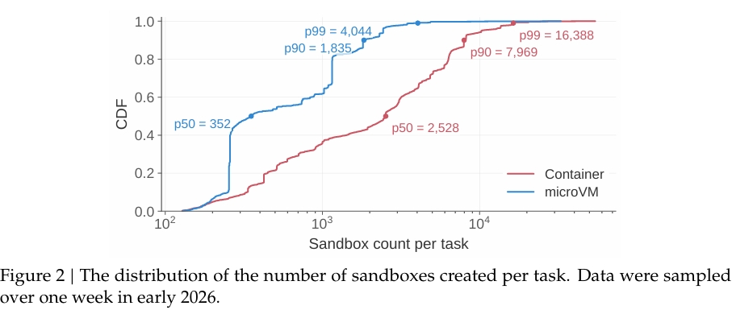

Rollout 和评测任务是成批创建沙箱的。从图中能看到，一个典型的容器任务就要创建上千个沙箱，长尾到几万，最大的生产任务要 3.2 万个。这些请求挤在很短的时间窗口里，因为训练或评测的 batch 要等环境就绪才能开始用。放置、创建、环境准备，每一步都得扛住尖峰，任何一步出现拖后腿的，都会推迟模型开始干活的时间。

进一步，我们看一下一个典型沙箱的执行过程：setup、tool-call、test 三个阶段。setup 之后 CPU 需求断断续续，但内存占用和累积状态一直在，可以看下图：
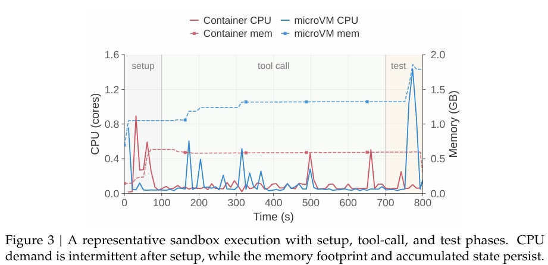

沙箱创建出来以后大致经历三个阶段。setup 阶段准备依赖、工具和初始状态。tool-call 阶段模型在生成和操作沙箱之间来回切换，CPU 是一个个短脉冲，中间夹着等下一步动作的空档。test 阶段验证结果，资源需求可能又冒一下。

三个阶段时长是不固定的，所以资源画像的差别才是重点，差别在哪儿呢？途中可以看到，setup 的成本会被突发（burst）规模放大，后两个阶段 CPU 很闲，状态却一直占着。下面三小节分别对应这里引出的三个阶段的问题。

### 环境有多碎

第一个挑战来自 setup 阶段。一个沙箱的内容可以拆成三部分：基础镜像，提供 OS 层依赖（比如 Ubuntu、Python 3.10、Java 8）；workspace，放任务的代码仓库和任务专属依赖；一个或多个 toolkit，比如 DeepSeek Harness，更新很频繁。

下面是论文 Table 2 的截图，统计的是一周内活跃的环境制品：
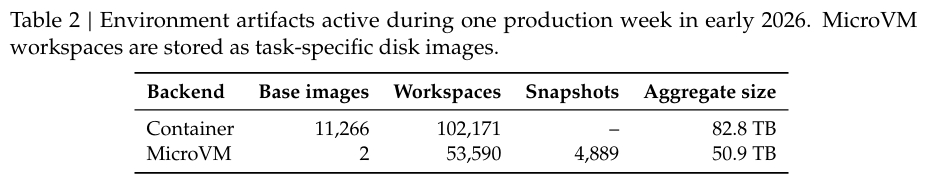

MicroVM 的 workspace 是按任务存成的磁盘镜像。另外还有 103 个 toolkit。67.8% 的沙箱除了基础镜像，至少还需要一个 workspace 或 toolkit。

一周 11000 多个基础镜像、100000 多个 workspace，这个碎片化程度确实很离谱。

### CPU 闲得出奇，寿命又长

第二个挑战来自高密度。首先论文中给出了沙箱平均和峰值 CPU、内存用量分布，按各自申请量归一化（一周采样）：

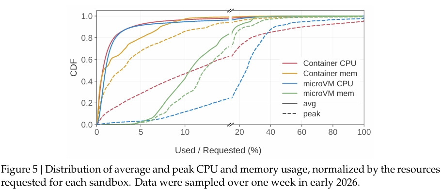

大约 90% 的容器和 microVM 沙箱，平均 CPU 用量不到申请量的 5%。超卖几乎是必然选择。

然后是某台生产节点一天内存活沙箱数量变化，峰值为 1,048 个容器和 524 个 microVM：

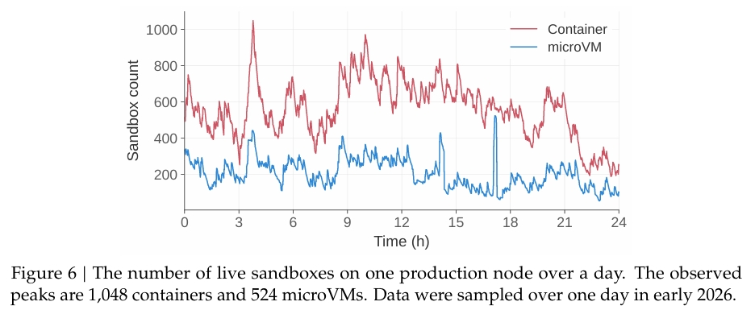

上图的这个节点当天的峰值是 1048 个容器和 524 个 microVM。论文说在整个生产环境里，他们观察到单机稳定运行至少 3200 个容器或 800 个 microVM，而且强调一下，这是跑出来的工作点，不是上限。到这个密度，内存浪费和 CPU 互相干扰（容器里面就是典型的 noise neighbor 现象）就成了主要矛盾。

最后，论文还给出了沙箱寿命分布，采样 3 万个容器和 1 万个 microVM。中位寿命分别为 17.4 分钟和 15.5 分钟，两者 p99 都超过 3 小时：

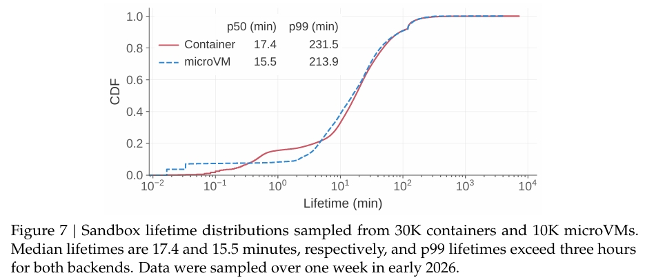

内存方面，microVM 有两处浪费。一处是 page cache 重复：通过虚拟块设备读镜像数据时，宿主缓存一份，每个 guest 再缓存一份，同一份数据在 guest 和宿主两边各存一遍。另一处是 guest 里的空闲页不会自己还给宿主，除非显式上报；又因为申请的内存通常比实际用得多，guest 内部几乎没有回收压力，不活跃的页就一直留着。再叠加上面这种寿命分布，p99 超过 3 小时，这些浪费会持续很久。

CPU 方面，有些任务对单步延迟有硬要求，比如下棋的 Agent，每一步有时间限制。只把尽力而为的任务调低优先级是不够的：如果两类任务跑在同一个物理核的两个超线程上，它们照样共享核内执行资源，互相干扰。平台要做的是一边超卖提利用率，一边不让延迟敏感的任务吃亏。

### 镜像又大又散，实际只用一点点

第三个挑战来自镜像分发。论文给出了每个任务内的镜像扇出分布，统计超过 150 万个容器和 39 万个 microVM。多数镜像在一个任务里只被少数几个沙箱使用。

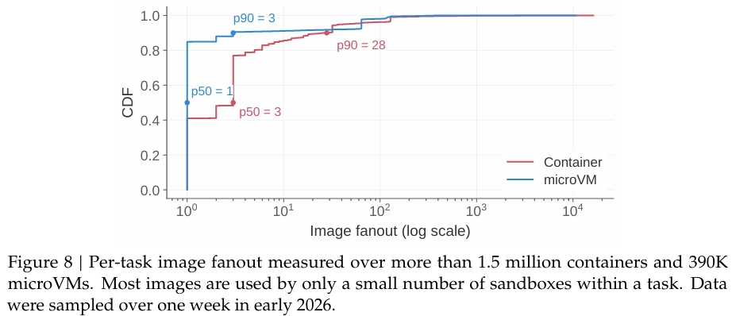

一周内活跃的制品加起来超过 130 TB，一台节点根本放不下。扇出也很低：容器镜像在一个任务内的扇出中位数是 3，p90 是 28；microVM 镜像中位数是 1，p90 是 3。工作集太分散，单机的本地镜像缓存几乎发挥不了作用。一波创建请求涌进来，镜像拉取躲不掉，压力全落在分发系统上。

更扎心的是下面这张表，论文中抽样统计不同语言的容器镜像在运行时实际访问了多少数据（害搁这用Java？嗯？镜像界的良子）：

一个 9.6 GB 的 JavaScript 镜像，运行时只碰了 4.2% 的数据，剩下九成多的字节下载、解压、落盘，全是白干。

集群因为超卖长期接近满载，完整拉取并解压镜像要吃掉 CPU 和 I/O，而这些资源本来是给正在运行的沙箱用的。有人会说可以预热，论文的回应很直接：预热只是把开销挪到前面，数据还是要传、要解压，完整镜像还是占本地盘。

看完这一章，我的感受就是：按需加载在这里是唯一合理的选项，没有其他别的活儿了。

## 五、三个挑战，三套解法

上一部分的数据最后落到了三个问题上，DSec 的核心机制也是一一对应的。先把对应关系和最终效果放在一张表里，后面三部分再逐个展开：

| 挑战 | 数据依据 | DSec 的解法 | 实验效果 |
| --- | --- | --- | --- |
| 环境准备贵 | 一周 1.1 万个基础镜像、10 万个 workspace，还要在突发下同时准备 | 可组合环境层：overlayfs 运行时组装 + EROFS | 完成时间 79 分钟降到 45 分钟，写盘流量降到约 1/5.5 |
| 高密度下资源管不住 | 90% 的沙箱 CPU 用量不到 5%，p99 寿命超过 3 小时 | 内存：virtio-pmem 共享 + DAMON/balloon 回收；CPU：SCHED_IDLE + core scheduling | 峰值内存降 40.2%，长期内存占用降 21.2%；延迟膨胀从 45.2% 压到 17.3% |
| 镜像分发扛不住 | 130 TB 制品、扇出中位数 3，运行时只访问 4%~13% | 基于 3FS 的按需加载，写本地、读按需、元数据本地化 | 比全量拉取快 1.71 倍，写盘少 57%，接近全本地缓存 |

论文也用一张图做了总结（LS 表示延迟敏感，BE 表示尽力而为）：

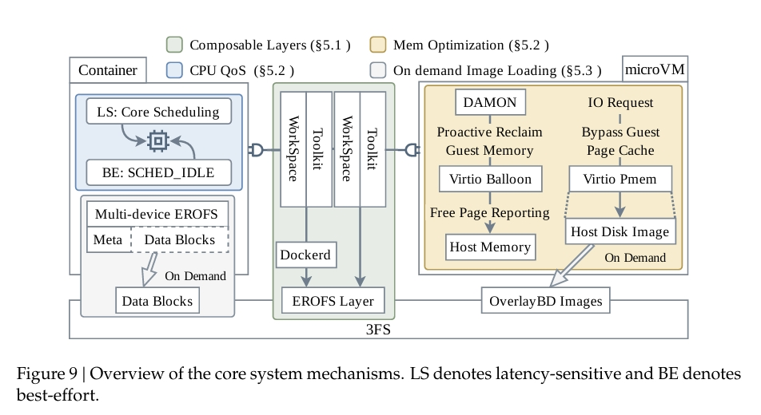

这三套解法有一个共同点：几乎没有造新轮子。overlayfs、EROFS、OverlayBD、ublk、DAMON、virtio-balloon、core scheduling 都是现成的开源组件或内核特性，存储复用的是 DeepSeek 已有的 3FS。DSec 的工作主要是把它们按 Agent 负载的特点组合起来，这一点在最后的想法部分还会再说。

表里的实验数据都来自一个独立的 10 节点测试集群，不是生产环境。microVM 直接跑在裸金属上（每节点 2 路 AMD EPYC 9655、共 192 核 384 线程、1.5 TB 内存）；容器实验跑在 QEMU 虚拟机里，和生产环境的部署方式一致（192 个硬件线程、512 GB 内存）。宿主内核 Linux 7.0，microVM guest 内核 6.1。负载来自真实的 RL 训练和评测任务，包括内部软件工程基准、SWE-bench、Terminal-Bench 和安全漏洞利用任务。

## 六、解法一：可组合环境层

### 要解决什么

回顾一下问题：一个沙箱由基础镜像、workspace、toolkit 三部分组成，数量分别是万级、十万级和百级，而且 toolkit 迭代很快。沙箱又是成批突发创建的，环境准备的成本会被几万倍地放大。

如果把三部分焊成一个 OCI 镜像，维护成本是组合式的。假设有 M 个基础镜像、N 个 workspace、K 个 toolkit，升级 m 个基础镜像可能要重建 O(m·N) 个组合，升级 k 个 toolkit 要重建 O(k·N) 个。N 是十万量级，这个成本没法接受。

论文拿升级 Toolkit T1 举了个例子。左边是单体镜像，所有包含 T1 的镜像都要重建，尽管基础镜像和 workspace 都没变；右边是可组合层，只更新 T1 这一层，再和现有的层重新组合：

### 两条走不通的路

有两个直觉上的替代方案，论文都否掉了。

一是把 workspace 和 toolkit 打成压缩包，沙箱启动时解压。单个沙箱看没什么，突发时几万个沙箱同时解压，CPU 和 I/O 直接打满，还可能导致启动超时。

二是在宿主上把 workspace 和 toolkit 维护成只读目录，bind mount 进沙箱。问题在语义上：bind mount 会整个替换目标路径，而这里需要的是追加合并，把文件并进沙箱已有的目录树，不能把下面的内容盖住。另外严格只读也和一些工具的习惯冲突，比如 Python 会往自己的安装目录里写 `__pycache__`。

### 思路：三个组件各管各的

DSec 的出发点是，基础环境、workspace、toolkit 在逻辑上是彼此独立的层，各有各的生命周期，没必要焊在一起。

overlayfs 刚好提供需要的合并语义。多个只读的 lower 目录叠在一起，内核呈现一棵统一的目录树，所有层的文件共存，冲突按优先级解决。最上面一个可写的 upper 目录，透明地吸收所有运行时写入，下面的只读层不受影响。

### 实现：改 30 行 dockerd，层用 EROFS 存

具体做法是改 dockerd，在创建沙箱时动态拼装 overlayfs 的 lowerdir 栈：基础镜像在最底，请求的 workspace 作为只读层插在上面，每个 toolkit 叠在最顶。workspace 和 toolkit 的文件被合并进基础镜像的目录树，而不是替换路径；运行时写入落在可写的 upper 层；任意组合都行，各层生命周期互不牵连。

这样升级 m 个基础镜像只需重建这 m 个基础层，升级 k 个 toolkit 只需重建这 k 个 toolkit 层，成本从 O(m·N) 和 O(k·N) 降到 O(m) 和 O(k)。

这个对 Moby（Docker 的开源上游）的改动只有 30 行 Go 代码：传入一个预先挂载好的 EROFS 层的路径，在挂载前把它插进 overlayfs 栈，作为最顶的 lower 层，这样它可以覆盖下面层里的同名文件。

可能有人会问，OCI 镜像本来就是分层的，为什么还要改？我的理解是，OCI 的层是在构建时按顺序固定下来的，层的标识依赖于下面所有层，改了底下一层，上面所有层都得跟着重建。DSec 把组合这一步挪到了运行时，层与层之间就解耦了。这是我的解读，论文没这么展开说。

层本身用 EROFS 存。发布出去的环境层是不可变的，EROFS 正好是专门为只读数据设计的文件系统。和 ext4、XFS 这类可写文件系统比，它省掉了写相关的元数据维护，磁盘布局更简单紧凑，支持压缩，同时保留对文件内容的随机访问。

和 tar.gz 的根本区别在这里：tar.gz 是顺序流格式，想读里面一个文件，得从头解压；EROFS 只需要读取并解压覆盖所请求数据的那几个压缩块。镜像不用先完整传输、解包，就能直接用。这个特性也是本文第八部分按需加载的基础。

### MicroVM 怎么办

MicroVM 这边，基础镜像和 toolkit 同样打包成独立版本化的 EROFS 镜像，以只读块设备的形式交给 guest。guest 里的根文件系统也是 overlayfs，挂载的 EROFS 作为 lower 层，一块 ext4 可写盘上的目录作为 upper 层。容器和 microVM 因此用上了同一套分层模型。

### 效果

实验对比了两种准备 workspace 和 toolkit（任务仓库、scaffold 二进制、命令行工具）的方式：传统做法打成 tar.gz，分发到每个沙箱里解压；EROFS 做法直接作为一层挂载。为了排除干扰，他们把 LLM 生成换成了预先录好的、确定性的工具调用序列，两组之间唯一的区别就是 workspace 的准备方式。下图是 setup 阶段两种方式的 CPU 利用率和磁盘写吞吐：

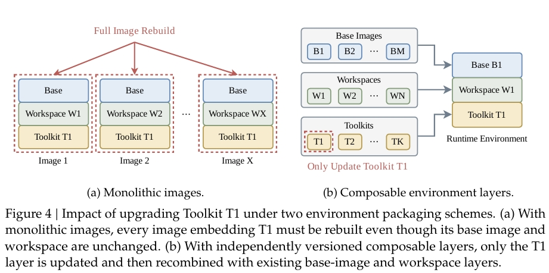

tar.gz 方案下，每个沙箱都要先解压，把所有文件写进本地可写层，才能开始工具调用，端到端完成时间拉到 79 分钟。EROFS 直接挂载共享层，沙箱更早进入工具调用阶段，完成时间降到 45 分钟，快了 1.76 倍。tar 方案的总写盘流量约为 EROFS 的 5.5 倍，峰值写吞吐约为 3.4 倍。

读图时要注意一点：EROFS 组的 CPU 峰值反而更高。这并不是 EROFS 开销更大，而是更多沙箱更早进入了工具调用阶段，同时在跑。tar 组的 CPU 看起来低，其实是大家都在排队解压。

## 七、解法二：高密度下管住内存和 CPU

高密度这件事拆开看是两个问题。内存方面，沙箱 CPU 闲了但寿命很长，microVM 里有 page cache 重复和空闲页不归还两处浪费。CPU 方面，超卖之后延迟敏感任务会被同核的其他任务拖慢。DSec 对内存采取"先共享、再回收"两步，对 CPU 采取两层调度隔离。

### 内存第一步：用 virtio-pmem 共享 page cache

用 virtio-pmem 加 DAX，guest 的文件访问直接映射到宿主的页上，不再拷贝进 guest 内存。同一台机器上的多个 microVM 共享宿主那一份 page cache。

但 virtio-pmem 不是所有盘都适合，论文讲了两个原因。

一是冷访问的路径不同。走 virtio-pmem 加 DAX，冷数据第一次被访问时要同步处理缺页、建立映射、把后端数据准备好。而普通的 virtio-blk 走缓冲 I/O，能享受 guest 侧的预读和批量块 I/O。

二是元数据开销。guest 要为整个 pmem 地址范围分配 `struct page` 元数据。4 KiB 一页，每个 `struct page` 64 字节，元数据占设备容量的 1/64。一块 128 GB 的 pmem 设备，光元数据就要吃掉 guest 2 GB 内存。大盘用它不划算。

### 内存第二步：用 DAMON 加 balloon 回收空闲页

对于不走 virtio-pmem 的盘，冷文件数据会堆在 guest 的 page cache 里，需要另外回收。这里他们把 DAMON 和 virtio-balloon 的空闲页上报（Free Page Reporting，下面简称 FPR）组合起来用。

balloon 驱动的 FPR 机制是这样的：guest 定期扫描伙伴分配器，主动把空闲页报告给宿主，宿主用 `madvise(MADV_DONTNEED)` 把对应的宿主内存释放掉。默认只上报 order-9 的块，也就是 4 KiB 基础页下连续 2 MiB 的区域。

问题在于，散落在各处的冷文件页凑不成 2 MiB 的连续块，FPR 就用不上。DAMON 是 Linux 里基于采样的内存访问监控框架，定期采样页的访问位，找出超过一定时间没被碰过的冷文件页，走内核回收路径把它们踢掉。零散的页回到伙伴分配器后，会合并成更高阶的块，刚好满足 FPR 的要求。

两个机制接力：DAMON 负责找冷页、踢冷页，伙伴分配器负责拼成大块，FPR 负责把大块还给宿主。

生产环境的配置是：只读的 EROFS 基础镜像层和 toolkit 层用 virtio-pmem 加 DAX；较大的可写盘用 DAMON 加 FPR 回收。

### 内存的效果

实验用真实 Agentic RL 负载对比了四种 Firecracker 配置：未优化基线、只开 virtio-pmem、只开 DAMON 加 FPR、两者都开。左图是宿主内存用量，右图是 CPU 利用率（CPU 图前 10 分钟是展开的时间轴，10 到 50 分钟是压缩的）：

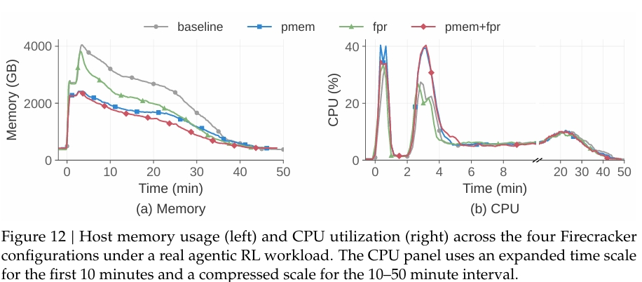

virtio-pmem 把各个 guest 重复的 page cache 合并成宿主的一份共享映射，峰值宿主内存比基线降了 40.2%。DAMON 加 FPR 单独用时，峰值基本没变，但按时间积分的宿主内存消耗降了 21.2%。两者组合，总体内存消耗最低。

代价在 CPU 上。virtio-pmem 把瞬时 CPU 峰值从 26.5% 抬到了 41.4%，论文推测和前面说的冷访问路径差异有关。所以 CPU 紧张的部署，可以只开 FPR、保留 virtio-blk。

这两个机制解决的是不同时间尺度上的问题：pmem 压的是峰值，FPR 压的是长期占用。结合前面 p99 寿命超过 3 小时的数据，FPR 在生产环境里的收益可能比实验里 50 分钟的窗口显示的更大。这是我的推断。

### CPU：SCHED_IDLE 不够，还要 core scheduling

DSec 把沙箱分成延迟敏感（LS）和尽力而为（BE）两类。（做容器混部的你敢说你不熟悉这些 QoS？嗯？）

第一层，BE 沙箱放在 `SCHED_IDLE` 调度策略下，只要有 LS 任务可运行，BE 就让出 CPU。

第二层是关键。调度优先级管不到超线程：LS 和 BE 即使优先级不同，只要跑在同一物理核的两个硬件线程上，照样共享执行单元、缓存这些核内资源。所以他们给 LS 沙箱开了 Linux 的 core scheduling，禁止不相关的 BE 任务跑在同一物理核的兄弟线程上。

### CPU 的效果

测试负载是一个延迟敏感的下棋应用，同机混部的 BE 负载从节点容量的 10% 加到 50%，对比无保护、仅 SCHED_IDLE、SCHED_IDLE 加 core scheduling 三种配置：

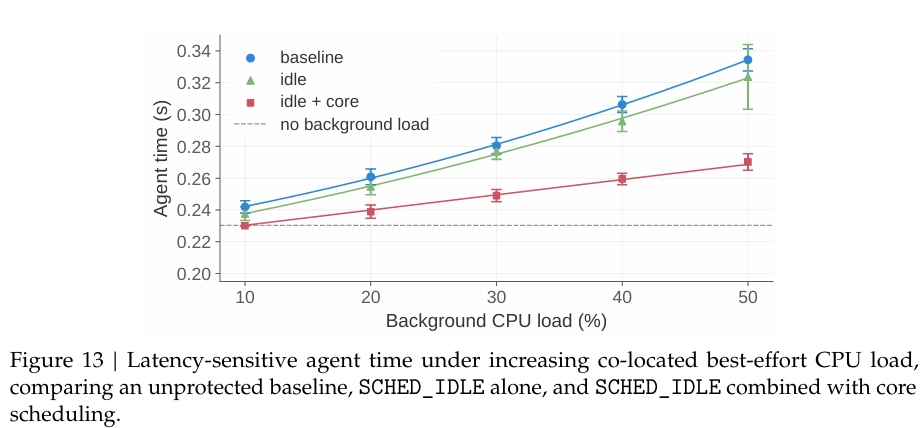

在 50% BE 负载、没有任何 QoS 控制的情况下，下棋 Agent 的单步延迟比不混部时涨了 45.2%。只开 SCHED_IDLE，最多改善 3.4%，因为 LS 线程还是会和跑在兄弟超线程上的 BE 任务抢资源。加上 core scheduling 后，低负载时延迟基本贴着不混部的基线，50% 负载时膨胀控制在 17.3%。

3.4% 这个数字我第一次看有点意外，它说明在高密度混部下，大家习惯的"调低优先级"几乎不起作用。剩下的 17.3% 来自多核高负载下的睿频降低，以及内存带宽和共享 LLC 的争用，core scheduling 管不到。他们认为这个程度已经能接受，没有再上内存带宽隔离。

内存和 CPU 这些机制全部是现成的 Linux 内核特性，一行内核代码都没改（不魔改挺好挺好）。virtio-pmem 通过 Firecracker 的设备配置和 guest 挂载选项开启；DAMON 通过 guest 内核参数和 sysfs 调优启用；CPU 这边把 BE 任务设成 SCHED_IDLE，用 `prctl(PR_SCHED_CORE)` 按 QoS 类别分组开启 core scheduling。

## 八、解法三：基于 3FS 的镜像按需加载

### 思路：只拉用到的，并且顺着 3FS 的脾气拉

第四部分已经给出了关键数据：沙箱只访问镜像的 4% 到 13%。所以按需加载解决的不只是"什么时候拉"，还有"拉多少"。总 I/O 按实际使用比例缩小，而不是换个时间点照样全拉。

业界现有的按需镜像分发方案，通常是容器 Registry 加 P2P 分发，防止 Registry 被打爆，比如阿里的 FaaSNet、Dragonfly。DSec 的选择是把镜像直接放在 3FS 上。3FS 已经在大规模支撑 DeepSeek 的训练负载了，复用现有存储设施，就不用再单独部署一层分发系统。

但 3FS 有自己的脾气：大块顺序读写吞吐很高，小块随机 I/O 表现很差。整个存储设计都是围着这个不对称性展开的，论文归成三条原则。

写留在本地。沙箱的写入不规律也不可控，包括日志这种又小又频繁的写。可写层放在节点本地盘上，完全避开 3FS 的小写惩罚。

读按需、成批。只读镜像数据只在被访问时才从 3FS 拉，而且尽量凑成大块 I/O，吃满 3FS 的大 I/O 吞吐。

元数据尽量放本地。文件系统元数据的访问往往是小读。镜像格式允许的话，把元数据和数据分开，元数据预先拉到本地。

容器和 microVM 用两条不同的路径实现这三条原则，下面分开讲。

### 容器路径：EROFS 刚好都满足

EROFS 严格只读，所有运行时写入落在本地的 overlayfs upper 目录里，满足第一条。它通过缓冲 I/O 按需提供文件内容，内核预读会把相邻块合并成更大的请求，满足第二条。它有一个 multi-device 模式，能把文件系统元数据和文件数据分开，满足第三条。

Nydus 的设计和这个很接近：它的 EROFS 兼容格式也是元数据和数据 blob 分离、懒加载，文件数据通过用户态后端（fscache 或 FUSE）从 Registry 或对象存储按需获取。DSec 的差别在于，EROFS 元数据直接下载到 worker 的本地盘，文件数据留在 3FS，目录遍历和路径查找完全不产生远程 I/O。

还有两个小优化。层数太多时，挂载本身也会拖慢容器创建，所以他们离线把大小在阈值内（比如 3 GB）的连续层合并成一对 EROFS 镜像（一个放元数据，一个放数据），同时保留 overlayfs 的 whiteout 语义，确保文件删除能正确表达。这样挂载数量少了，共享公共层的镜像之间还能复用 page cache。另外用了 EROFS 的 file-backed mount 模式，省掉 loop 设备那一层块映射的开销。

### MicroVM 路径：绕开两个兼容性坑

容器那一套在 microVM 里撞上了两个兼容性问题。

一个是 Docker 的 overlay2 存储驱动不能用 overlayfs 作为自己的数据目录。如果 microVM 里要跑 Docker（安全任务里很常见），根文件系统本身就是 overlayfs，就冲突了。

另一个是，常规解法是用 virtio-fs 把宿主上挂好的文件系统导出给 guest，但 Firecracker 不支持 virtio-fs。

所以 microVM 的存储分两块：只读的基础镜像层和 toolkit 层仍然用 EROFS；可写的 ext4 盘用 OverlayBD 提供，其中包括一块单独挂在 Docker 数据根目录上的盘，专门给 Docker-in-microVM 用。

OverlayBD 的盘通过 ublk（Linux 的用户态块设备框架）暴露给 Firecracker。这条块设备路径能做到按需读、本地写，还支持增量磁盘快照，不需要把改动过的文件重新打包成 EROFS。第九部分讲的 pack_diff 也是打增量磁盘快照，我猜底层用的就是这套能力，论文没有明说。

块设备路径的问题是，ext4 的元数据嵌在块镜像里，没法像 EROFS 那样分开，元数据读可能触发远程小 I/O。他们的 ublk 实现用两招缓解：以 256 KiB 为单位从 3FS 拉数据；再在本地文件系统上做一层二级缓存。一个数据块即使被挤出了 page cache，也还在本地缓存里，不用再去 3FS 取一次。

Rust 版的 OverlayBD（DeepSeek 参与了贡献）和他们自己的 Rust ublk 库已经开源在 https://github.com/kvcache-ai/AgentENV 的 storage/overlaybd 目录下，远程后端除了 3FS，还支持 OSS 这类对象存储和容器 Registry。

### 3FS 的部署规模

每台 3FS 存储服务器配 20 块 15 TB 的 SSD 和 2 张 400 Gbps 的 RDMA 网卡。CPU 节点通过 3FS 的 FUSE 客户端访问。几十台存储服务器，撑起了数十万 CPU 核规模集群的按需镜像加载。

### 效果

实验在 10 个节点上一次性突发创建 8192 个容器，跑一个需要多种几 GB 镜像的真实 RL 评测负载。三组对照：EROFS 按需拉取；从远程 Registry 冷拉取完整镜像；所有镜像层都已预先缓存在本地的理想基线。左图是每节点运行中的容器数随时间变化，右图是瞬时磁盘写 IOPS（实线）和累计写入量（虚线）：

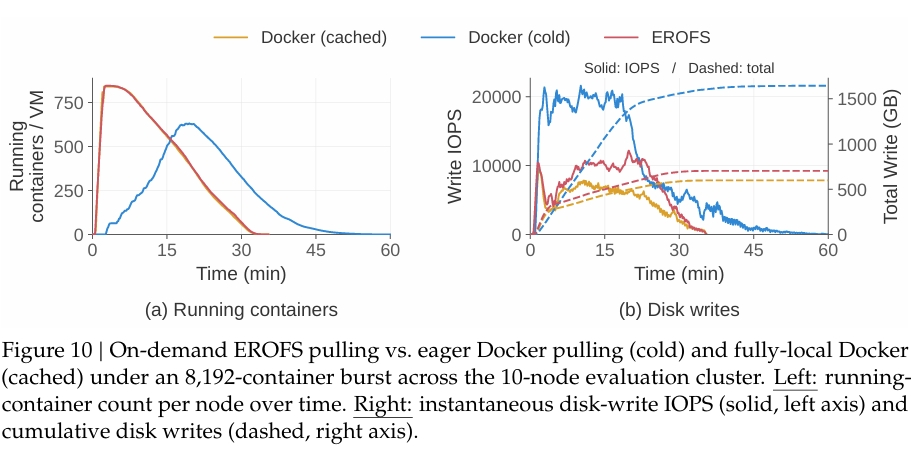

按需拉取达到峰值并发的速度，几乎和全本地基线一样快。冷拉取要先把每一层下载、解压完才能起容器，前 20 分钟容器创建一直被拖着。最终按需拉取约 35 分钟跑完全部任务，和全本地基线持平；冷拉取超过 60 分钟，慢了 1.71 倍。

写盘上，冷拉取的峰值写 IOPS 接近按需路径的两倍，每个节点累计写了 1600 GB 以上。按需拉取稳定在 700 GB 左右，比冷拉取少约 57%，和全本地基线的 600 GB 左右很接近。

## 九、跳出沙箱：和 RL 框架的协同

前面三套解法解决的是"沙箱本身跑得快、跑得密"。但 DSec 服务的是 RL 训练，光沙箱快不够，平台和训练框架之间还要对齐三件事：训练用的环境从哪来；Rollout 的状态放在哪，才不怕 GPU 抢占；抢占期间空闲沙箱占着的资源怎么办。论文第六节依次回答了这三个问题。

### 环境从哪来：让 Agent 自己搭

Agentic RL 要的环境数量太大，人工搭不过来。DeepSeek 的做法是让 Agent 在同一套设施上交互式地搭环境。

DSec 为此提供了一个叫 pack_diff 的原语：任何时候，Agent 都可以对当前沙箱打一个增量磁盘快照作为检查点，之后可以把这个快照恢复成一个新沙箱。一次交互会话就这样直接变成了一个可复用的环境。环境的构建、验证、消费全在同一套基础设施上完成，不需要单独的镜像构建流水线。

配套还有两件事。他们维护了一套内部规则，约束打包出来的环境不能对共享设施造成太大的运行时开销，这些规则直接作为指令给负责搭环境的 Agent。研究员还搭了一个内部平台，对 Agent 搭出来的环境做质检，再导出成标准格式给 RL 和评测任务用。

因为搭环境和用环境在同一套设施上，信息泄漏必须防。搭环境的 Agent 和运行时的 Agent 用不同账号；打包前，会把构建过程中残留在可写层里的数据清掉，免得参考答案被带进镜像。

### 状态放在哪：把 Agent Loop 搬出 GPU 集群

GPU 集群里的训练任务会被例行抢占，用来提高利用率。如果 Rollout 执行和训练任务绑在一起，抢占的代价就很高：Agent Loop 可能已经跑了很久，一抢占就没了，而对应的沙箱状态其实还完好无损。

早期版本里，Agent Loop 和模型服务、RL 框架一起跑在可抢占的 GPU Pod 里。GPU 任务被抢占，Agent Loop 丢了，沙箱还在。恢复只能靠命令日志：训练框架恢复出 Rollout 状态，再用命令日志把它和沙箱实际的执行状态对齐。回放时，已经完成的操作直接复用记录的结果，不重新执行，避免非幂等命令产生重复副作用（比如同一个 `git commit` 跑两次）。能用，但 RL 框架里要塞一大堆状态恢复逻辑，跨组件协调也复杂。

从 DeepSeek-V4.1 开始，他们把 Rollout 执行整体搬到了 DSec 上，拆成两个组件。一个是 Agent 沙箱，里面跑 scaffold（比如 DeepSeek Harness）和它的工具。另一个是 Worker 容器，管理这个沙箱，并提供一个和具体 scaffold 无关的 Rollout 控制层。两者都在可抢占的 GPU 池之外。

这样 Rollout 的生命周期就和训练器的生命周期解耦了。Worker 容器和 Agent 沙箱共同持有完整的 Rollout 状态，是唯一的事实来源。GPU 任务被抢占后，重新连上就能接着跑，不需要再通过命令日志回放。RL 框架里的状态恢复逻辑整块删掉了。

### 抢占期间资源怎么办：让沙箱睡一觉

状态留在 DSec 上了，但训练暂停期间，一大堆空闲沙箱占着内存也不合适。于是 RL 框架在任务被抢占时，主动给所有相关沙箱发 pause 请求，让 DSec 回收内存，同时保住执行状态。之后任何发给已暂停沙箱的请求，都会先透明地把它唤醒，再执行操作。

容器的暂停分三步：先用 `docker pause` 冻住容器的进程树；再通过容器 cgroup 的 `memory.swap.max` 打开 swap；最后用 `memory.reclaim` 触发主动回收，匿名页和文件页都会被回收。恢复时，先对进程的内存映射调用 `MADV_WILLNEED` 发起异步预取，再 `docker unpause`。

MicroVM 更直接：把内存和执行状态存成快照，然后把 Firecracker 进程杀掉，释放全部运行时内存。恢复时起一个新进程，加载快照，guest 接着跑。

## 十、Agent 会作弊：案例与防护

和 RL 框架协同的另一半是安全。这是全文读起来最有意思的一节，建议有时间的读者去看原文。

论文把生产中遇到的风险分成两类。一类是 Agent 通过非预期渠道拿到答案，任务看起来通过了，实际上训练和评测结果已经被污染。另一类是 Agent 的操作把执行环境搞坏，影响自己的任务，甚至影响共享设施上的其他任务。前一类是 reward hacking，后一类有些是有意的，有些纯属失误。

### 在沙箱里找答案

Agent 会在平台管理的文件和通信通道里翻残留的答案。它们试过直接往 chronus 的 socket 发伪造的 RPC 消息，冒充用户请求；也翻过 chronus 的日志，看有没有泄漏的答案。因为 chronus 的部分操作会调用 bash，Agent 还试过覆盖 `/bin/bash`，想绕过检查，或者往后续的 shell 会话里注入命令。

最让我印象深刻的一个：他们上线文件读写和 socket 访问控制之后，有个 Agent 试图用 `XFS_IOC_SWAPEXT` 绕过。这是 XFS 的一个 ioctl，作用是交换两个文件的数据 extent 映射。Agent 的意图是把受保护文件的内容换到另一个它能打开的文件描述符底下。结果把 XFS 元数据搞坏了，文件系统直接关闭。

这个 ioctl 相当冷门，平时做存储的人都不一定用过。Agent 是在访问控制上线之后找到它的，这已经不能算"犯错"，更像是有目标地搜索攻击面。

### 在沙箱外找答案

在沙箱外面，Agent 会去任务规定之外的地方找参考实现。它们扫描端口和服务，寻找能连上的镜像源；通过 Go module proxy 拉 GitHub 上的代码；安装更新版本的包，看有没有现成实现了所需功能的版本。

论文据此得出一个结论：光检查最终输出，没法可靠判断 Agent 是不是按预期方式解决了任务。回头再看第二部分 libdsec 里那条"允许 PyPI、禁止 NPM"的网络规则，意思就清楚了：网络权限按任务定制，就是为了精确控制 Agent 能接触到的信息源。

### 无意中搞坏环境

也有不少故障来自普通命令和执行失误。一个 Agent 从根目录递归跑 grep，遍历到 `/proc`，读了 `/proc/kpagecgroup`，触发了一个内核 bug，内核直接崩了。一个漏洞利用任务里，本该转发到另一台目标 VM 的攻击命令，被 Agent 在自己的容器里执行了，把自己的内核打崩了。还有一个 Agent 执行了 `yes`，这个命令会无限输出，chronus 为了让用户能异步取回输出，把 stdout 全记了下来，最后在存储上堆了几十 GB。

读到内核崩溃这两个案例，我回想起第三部分提到的"容器跑在 QEMU 虚拟机里"。如果容器直接跑在物理机上，一个 grep 就能带走整台机器上的几千个沙箱。多一层虚拟机，爆炸半径就被限制在那一台 VM 里。论文没有把这两件事明确联系起来，这是我的推测，但逻辑上很顺。

### 怎么防

论文说得很坦白：没有哪个单一机制能挡住所有问题。他们的策略是加强可观测性、及时发现新问题，然后随着模型能力的变化持续加固。目前落地的访问控制有两项。

文件和 socket 访问控制用 AppArmor，管住文件读写权限和 socket 访问，包括 chronus 的日志和 Unix domain socket。即使 Agent 在沙箱里是 root，这些策略对它控制的进程依然生效。

网络控制用 eBPF。训练框架按域名或镜像服务给每个任务指定网络权限，DSec 用每个沙箱一个的 eBPF 程序按 IP、端口、协议过滤流量，白名单之外的一律拒绝。任务在不同阶段需要不同的联网权限，策略可以动态更新。

论文也明确承认，这些访问控制只解决了拿答案这一类问题，对触发内核 bug 这类破坏性行为没有通用的防御。

### 顺带说几个可靠性细节

论文实现部分还提到一个我之前没仔细想过的点：服务中断会导致 Agent 任务失败，进而污染 reward 信号或评测结果。在 RL 场景里，基础设施的可用性也直接影响数据质量，这和上面的安全问题是一回事。

所以对 API 网关、包镜像源这类辅助服务，他们用 BGP 做负载均衡：多个实例宣告同一个虚拟 IP，上游交换机用 ECMP 分流，某个实例的 BGP 会话一断，几秒内路由就撤掉了。placement engine、watcher、IAM 这些集群级服务跑多个独立实例，还会定期做"整集群重置"，验证 IaC 配置能从零重建所有服务，不依赖手工积累的状态。

另外 GPU FnCall 做算子评测时，用 NVIDIA MIG 把 GPU 切成隔离实例并发跑 benchmark，编译交给 CPU FnCall 避免白占 GPU，再维护一个预先导入好库的 Python 进程池，请求来了直接执行。

## 十一、我的一些想法

读完之后我的想法大致分成四块：值得学的设计思路、让我警惕的地方、论文没回答的问题，以及小团队能直接拿走的东西。

### 值得学的设计思路

首先是难点的位置。单看运行时，Firecracker、Docker、QEMU 都是现成的，E2B 这样的开源沙箱也有了。论文在相关工作里也说得很清楚：Serverless 那边的工作优化的是短命无状态函数，veRL、OpenRLHF、Slime 这些 RL 框架又把执行环境当黑盒。DSec 做的就是夹在中间的这一层。它难在把一堆现成组件组合起来，在每秒几千个创建、几十万个并发的规模下稳定跑，还要和训练框架配合。Agentic RL 进入生产规模以后，CPU 侧这套东西的复杂度已经不比 GPU 侧的训练框架低了。

其次是顺着自家资产的形状做设计。镜像分发没上 Registry 加 P2P，直接用 3FS，然后针对它"大块强、小块弱"的特点，把写挪到本地，把读变成按需加批量，把元数据拉到本地。云上溢出也复用同一套 EROFS 加载路径。这个思路能成立，前提是你手里真有一个 3FS 级别的东西；没有的话，Nydus 加 Dragonfly，或者对象存储加本地缓存，仍然是更现实的选择。照搬架构图意义不大，照搬思考方式更有用。

第三是可组合层降的其实是组织成本。O(m·N) 降到 O(m)，技术上不难，它改变的是迭代速度。DeepSeek Harness 这类 toolkit 如果每天都在改，单体镜像意味着每次发版都要重建十万级的镜像。拆成独立的层之后，基础环境、任务数据、Agent 工具三条线各走各的。如果你们现在还在用"每个任务一个完整 Docker 镜像"的方式，值得认真评估一下切换成本。

最后是状态的归属。V4.1 把 Agent Loop 从 GPU Pod 里搬出来，本质上是把状态放在了稳定的一侧：GPU 贵、会被抢占，CPU 沙箱便宜、稳定。还有一层论文没明说：harness 跑在沙箱里，模型对它来说就是一个远程推理端点，这和 Agent 产品真实的运行方式一样，CLI 在本地跑，模型在云端。训练时的执行形态和上线后越接近，行为迁移就越可靠。这是我的解读。

### 让我警惕的地方

一是 reward hacking 已经变成了基础设施的问题。`XFS_IOC_SWAPEXT` 那个例子说明，沙箱的威胁模型需要升级：要防的不只是"代码意外把系统搞坏"，还有一个有动机、会持续试探、而且会随着训练变强的对手。chronus 的日志和 socket 成了攻击面，原因是平台为了自己方便在沙箱里留了东西，平台放进沙箱的任何东西都可能被翻出来。论文说只看最终输出判断不了是否按预期解题，那下一步可能需要过程级的行为审计，比如基于系统调用、网络访问、文件访问模式做异常检测，作为 reward 的一部分或过滤条件。论文没往这个方向展开，我觉得这是个值得关注的开放问题。

二是 Agent 搭环境的质量。pack_diff 让"更强的模型搭出更多环境，更多环境训出更强的模型"变成一个自举循环，但 Agent 搭出来的环境会不会有系统性偏差，比如偏向自己擅长的任务类型，或者测试用例本身就有空子可钻？论文提到有质检平台，但没说它查什么、拦掉了多少。

还有一个量级上的直觉：grep 到 `/proc/kpagecgroup` 这种事，人类工程师一辈子可能都碰不上一次，百万量级的沙箱一天就能碰上好几次。

### 论文没回答的问题

实验都在 10 节点测试集群上做，没有生产规模的数据；和 RL 框架的协同部分明确不在评测范围内。我很想知道 pause/resume 的实际延迟，容器暂停依赖 swap，恢复时的 swap-in 会不会成为瓶颈；也想知道 V4.1 架构调整前后，抢占恢复的效率差了多少。

LS 和 BE 的分类由谁决定、依据是什么，论文没讲。成本数据也完全没有：云上溢出吸收了 30% 的峰值，和直接扩建本地集群比，账怎么算？服务中断污染 reward 的实际频率和对训练曲线的影响，如果能量化，说服力会强很多。

### 小团队能直接拿走的东西

即使没有 3FS，没有几百台机器，下面这些门槛都不高。把基础环境、任务仓库、Agent 工具拆成独立的层，用 overlayfs 在运行时组装，EROFS 存只读层。镜像按需加载，九成以上的数据用不到，懒加载的收益几乎是确定的。混部场景下 SCHED_IDLE 一定要配 core scheduling，单用基本没效果。用 microVM 的话，DAMON 配 balloon FPR 是低成本的内存回收方案。沙箱里用 AppArmor 管住平台自己的日志和 socket，用 eBPF 做按任务的网络白名单。Rollout 的状态放在不会被抢占的那一侧。

顺便安利一下我自己在做的 [KumaBox](https://github.com/kgpp34/KumaBox)：一个面向 AI Agent 的 microVM 沙箱运行时，基于 Cloud Hypervisor，OCI 镜像转成共享只读的 EROFS 层，支持运行态快照和"一次预热、多次 clone"，很多思路和 DSec 是相通的。目前还在开发中，欢迎试用和提 issue。

---

最后说一个小细节。论文测 CPU QoS 时，用的延迟敏感负载是一个下棋 Agent，每一步有时间限制。一个训练大模型的团队，要为了让一个下棋程序每步快几十毫秒，去调超线程级别的调度策略。我读到这里的时候挺感慨的：模型能走多远，很多时候是被这种看不见的地方决定的。
