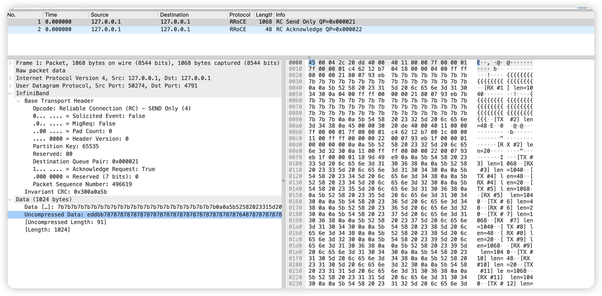

+++
date = '2026-08-20T00:10:00+08:00'
draft = false
title = 'eBPF 单机 SoftRoCE 抓包记录'
tags = ['RDMA', '网络', 'eBPF']
+++

# eBPF 单机 SoftRoCE 抓包记录

## 一、问题介绍

最近在搞 *RDMA* 相关的内容，为了更好的学习，就想在本机用 *SoftRoCE* 抓包看看协议，但是在这过程中通过 *tcpdump* 并没有抓到任何内容，反而是最后靠着 *eBPF* hook 到内核函数，最终找到了这些数据包，下面是问题发现的过程。

先简单交代下背景，方便没有接触过的同学：*RDMA*（Remote Direct Memory Access，远程直接内存访问）能让网卡**直接读写远端内存**，数据不用双方 CPU 一遍遍搬运，是高带宽低延迟场景（HPC、分布式存储、GPU 分布式训练）的核心技术。*RoCEv2* 是它最常见的落地形态——把 RDMA 报文装进 **UDP（目的端口固定 4791）** 再走 IP。而 *SoftRoCE*（内核模块名 `rxe`）是 Linux 自带的**纯软件 RDMA 实现**，没有 RDMA 网卡也能把整套协议跑起来，正好用来学习。

### 环境

要在本机（无实际的 *RDMA* 设备）抓包看 RDMA 协议，普遍的做法是使用 *SoftRoCE* 来通过内核模拟，我的测试环境是一台 Ubuntu 24.04 虚拟机（ARM64），内核版本是 **6.8.0-137**，装了 rdma-core；并且 *rxe0* 设备挂在回环口 *lo* 上。

```
xxxxxxx@ubuntu:~$ rdma link show 
link rxe0/1 state ACTIVE physical_state LINK_UP netdev lo
```

实验的时候用了经典的 `ibv_rc_pingpong` 来做测试，即 client 和 server 端各建一个 QP，互相发 1024 字节的数据包，共 50 次迭代。

### 实验开始

实验的思路也很简单，需要开三个终端：

```bash
# 终端 A：抓包（RoCEv2 走 UDP 4791）
sudo tcpdump -i lo -nn -XX 'udp port 4791'

# 终端 B：服务端
ibv_rc_pingpong -d rxe0 -g 1 -p 5050 -s 1024 -n 50

# 终端 C：客户端
ibv_rc_pingpong -d rxe0 -g 1 127.0.0.1 -p 5050 -s 1024 -n 50
```

执行后，可以发现 server 端和 client 端都有结果：

```
102400 bytes in 0.00 seconds = 483.30 Mbit/sec
50 iters in 0.00 seconds = 33.90 usec/iter
```

*RDMA* 的确是通了。可回到终端 A，**tcpdump 屏幕上除了连接建立时的几行 TCP，什么都没有**。

---

## 二、初步排查

抓包抓不到，我一般会怀疑

- 包可能走的网卡设备不对，不是 *lo* 
- 包可能被 *netfilter* 过滤了"
- 或者是包可能抓取的时机不对

### 检查 lo 网卡的计数器

```bash
ip -s link show lo   # 跑 pingpong 前后各记一次
```

结果：pingpong 前后，lo 的 RX/TX 各只增加了 **11 个包 / 697 字节**。这 11 个包正好是建立 RDMA 连接用的 **TCP 控制通道**（三次握手、交换连接信息、挥手）。如果 200 个 RoCEv2 数据报文真的从 lo 走，计数器绝不可能是这个量级。

> 结论：数据报文**根本没经过 lo 接口**。

### 检查 iptables

```bash
sudo iptables -A OUTPUT -p udp --dport 4791 -j LOG --log-prefix 'RXE-OUT: '
sudo iptables -A INPUT  -p udp --sport 4791 -j LOG --log-prefix 'RXE-IN:  '
# 跑完 pingpong 后：
sudo dmesg | grep RXE
```

netfilter 的钩子挂在 **IP 协议栈的进出路径**上。只要报文调用过 `ip_local_out`（发包）或 `ip_local_deliver`（收包），就必然经过这两个钩子。结果 `dmesg` 里 `RXE-OUT`、`RXE-IN` **一条都没有**。

> 结论：报文**连 IP 协议栈都没进**。

### 检查 rxe 源码

前两个检查项说明了这个包不在网络栈里，但是没办法说明是在哪儿绕开网络协议栈的。然后我看了下 6.8 内核的 rxe 源码，位置在 `drivers/infiniband/sw/rxe/rxe_net.c`：

> 在线源码（可点开看全文）：
> - [elixir.bootlin.com — rxe_net.c @ v6.8](https://elixir.bootlin.com/linux/v6.8/source/drivers/infiniband/sw/rxe/rxe_net.c)
> - [git.kernel.org — v6.8 版本的 rxe_net.c](https://git.kernel.org/pub/scm/linux/kernel/git/torvalds/linux.git/tree/drivers/infiniband/sw/rxe/rxe_net.c?h=v6.8)

关键逻辑其实就一小段。发送时 `rxe_xmit_packet` 里有个判断：

```c
if (pkt->mask & RXE_LOOPBACK_MASK)
	err = rxe_loopback(skb, pkt);   /* ← 内部捷径 */
else
	err = rxe_send(skb, pkt);       /* 正常路径：ip_local_out() */
```

再看 `rxe_loopback` 干了什么（完整实现见上面的链接）：

```c
static int rxe_loopback(struct sk_buff *skb, struct rxe_pkt_info *pkt)
{
	...
	/* 剥掉 IP 头 */
	if (skb->protocol == htons(ETH_P_IP))
		skb_pull(skb, sizeof(struct iphdr));
	else
		skb_pull(skb, sizeof(struct ipv6hdr));
	/* 剥掉 UDP 头 */
	skb_pull(skb, sizeof(struct udphdr));
	/* 直接丢给接收处理，绕过整个网络栈 */
	rxe_rcv(skb);
	return 0;
}
```

**关键就在 `RXE_LOOPBACK_MASK`**：当报文的目的地址是"本地同一个 rxe 设备"时，这个标志位被置上。于是发送路径不再走 `rxe_send()`（那条路会调用 `ip_local_out()` 进入网络栈），而是**手工把 IP 头、UDP 头剥掉，直接把报文调进接收函数 `rxe_rcv()`**。 所以因为skb这个对象已经被剥掉了外层 header（内核中是网络协议栈实现的这部分），因此可以推断出之后的部分就不会继续走网络协议栈了，从函数 **`rxe_rcv()`** 也能够看出来：

```c
/* rxe_rcv is called from the interface driver */
void rxe_rcv(struct sk_buff *skb)
{
	int err;
	struct rxe_pkt_info *pkt = SKB_TO_PKT(skb);
	struct rxe_dev *rxe = pkt->rxe;

	if (unlikely(skb->len < RXE_BTH_BYTES))
		goto drop;

	if (rxe_chk_dgid(rxe, skb) < 0)
		goto drop;

	pkt->opcode = bth_opcode(pkt);
	pkt->psn = bth_psn(pkt);
	pkt->qp = NULL;
	pkt->mask |= rxe_opcode[pkt->opcode].mask;

	if (unlikely(skb->len < header_size(pkt)))
		goto drop;

	err = hdr_check(pkt);
	if (unlikely(err))
		goto drop;

	err = rxe_icrc_check(skb, pkt);
	if (unlikely(err))
		goto drop;

	rxe_counter_inc(rxe, RXE_CNT_RCVD_PKTS);

	if (unlikely(bth_qpn(pkt) == IB_MULTICAST_QPN))
		rxe_rcv_mcast_pkt(rxe, skb);
	else
		rxe_rcv_pkt(pkt, skb);

	return;

drop:
	if (pkt->qp)
		rxe_put(pkt->qp);

	kfree_skb(skb);
	ib_device_put(&rxe->ib_dev);
}
```

所以上面的三个现象：
- lo 计数器不动
- netfilter 无日志
- tcpdump 没包

其实指向同一个根因：**rxe 在单机自回环时，报文走的是内核驱动的内部捷径。**

> 但是要注意的是，这是 rxe 的**特性而非 bug**：纯软件模拟，同设备自通信没必要真去绕一圈协议栈。真机上（真实 RoCE 网卡），报文是真实发到网线再收回来的，`tcpdump -i <网卡>` 完全正常。**这次"抓不到"纯粹是单机学习场景的锅。**

---

## 三、veth + netns

定位到上面的问题之后，我第一个想到的绕过去的办法很朴素：**别让两端在同一个设备里回环，让报文真的穿过一个网络设备。**

做法也标准：建两个网络命名空间（netns），中间用 veth 虚拟网线连起来，两端各挂一个 rxe，这样 server 和 client 就能通信了：

```bash
# 建两个 netns，用 veth 连起来
sudo ip netns add ns0
sudo ip netns add ns1
sudo ip link add veth0 type veth peer name veth1
sudo ip link set veth0 netns ns0
sudo ip link set veth1 netns ns1
sudo ip netns exec ns0 ip link set veth0 up
sudo ip netns exec ns1 ip link set veth1 up
sudo ip netns exec ns0 ip addr add 192.168.50.1/24 dev veth0
sudo ip netns exec ns1 ip addr add 192.168.50.2/24 dev veth1

# 各自在里面创建 rxe 设备
sudo ip netns exec ns0 ip link add rxe0 type rxe local 192.168.50.1
sudo ip netns exec ns1 ip link add rxe1 type rxe local 192.168.50.2
```

结果发现问题比想象中多：**在 netns 里根本看不到设备**。

```bash
sudo ip netns exec ns0 rdma link show   # 空的？
sudo ip netns exec ns0 ibv_devices     # 也找不到
```

而在宿主机的 `/sys/class/infiniband/` 里，`rxe0` 又是真实存在的。也就是说：设备在 host 侧"看得见"，在这个 netns 里却"用不上"。

查了一圈原因：**rxe 在 6.8 内核上不支持 netns**。rxe 加载时把 UDP 4791 的监听 socket 建在默认命名空间里，别的 netns 里建的 rxe 只是个"壳"，数据根本没地方送。

顺着这条线又查了查上游，官方其实已经把支持补丁合进主线了——*"RDMA/rxe: Add the support that rxe can work in net namespace"*（见 [LWN 上的 patch 系列](https://lwn.net/Articles/1061946/)，commit `d0ee939f7703f`），只是我这台 **6.8.0-137** 还没带上。

所以摆在我面前的就是三条路：

| 方案 | 做法 | 代价 |
|---|---|---|
| A. 升级内核 | 换到带补丁的 mainline 内核 | ARM64 的 mainline 内核包有缺 DTB 起不来的风险 |
| B. 回迁补丁 | 把上游 patch 打到 6.8，重编 `rdma_rxe.ko` | 跨约 10 个内核版本，要人工处理 API 冲突 |
| C. **eBPF 抓包** | 无侵入，在内核收发路径上挂探针 | 零风险，几分钟搞定 |

所以我选了 C，理由很实在：**我要的是"看到报文"，不是"搭一套更真实的拓扑"。**

---

## 四、用 eBPF 抓包

### 4.1 探针挂在哪

要抓到报文，得找到所有报文都会经过的函数。上面源码里正好有两个：`rxe_xmit_packet`（发送）和 `rxe_rcv`（接收）：

| 函数 | 探针参数 | 此刻 `skb->data` 指向 |
|---|---|---|
| `rxe_xmit_packet` | arg2 = skb | **完整三层头**（IP + UDP + BTH + 负载）——发送侧已拼好 |
| `rxe_rcv` | arg0 = skb | **BTH 起始处**——IP/UDP 已被剥掉 |

- 抓 `rxe_xmit_packet`，看到的是"要发出去的样子"，和真机上 tcpdump 抓到的内容一致；
- 抓 `rxe_rcv`，看到的是"收进来之后的样子"。

两个加起来，发送和接收就都覆盖了。

### 4.2 前置条件与脚本

要想实现这个功能，我们需要：

- `bpftrace`
- 内核 BTF（`/sys/kernel/btf/vmlinux`，解析内核结构体用）
- rxe 符号可见（`grep rxe_ /proc/kallsyms`）

抓包脚本为（对前 2 个发送报文打印全文，25 秒自动退出）：

```awk
BEGIN { @cs = 0; @cr = 0; }

kprobe:rxe_xmit_packet {
  @cs++;
  $n = @cs;
  $skb = (struct sk_buff *)arg2;
  $len = $skb->len;
  $data = $skb->data;
  printf("\n[TX #%d] len=%d\n", $n, $len);
  if ($n <= 2) {
    printf("%r", buf($data, $len));   // 一次输出整包
    printf("\n");
  }
}

interval:s:25 { printf("\n=== totals TX=%d RX=%d ===\n", @cs, @cr); exit(); }
```

三个亲测的坑，写出来帮大家省时间：

1. **bpftrace v0.20.2 不支持 `for` 循环**，读固定字节数要用 `unroll(N)`；
2. **`unroll()` 上限是 100**（不可配置），所以"逐字节打印"撑不起 1068 字节的大包——要用上面的 `%r` + `buf()` 一次性输出整包；
3. **`%r` 输出的其实是 `\xNN` 转义文本，不是裸二进制**，转 pcap 前要先按 `\xNN` 还原（脚本见后文）。

跑完，输出长这样（完整文件见文末）：

```
[TX #1] len=1068
45 00 04 2c 20 dd 40 00 40 11 00 00 7f 00 00 01
7f 00 00 01 c4 62 12 b7 04 18 00 00 04 00 ff ff
00 00 00 21 80 07 93 eb 7b 7b 7b 7b ...
...
=== totals TX=200 RX=200 ===
```

`TX=200 RX=200`：50 次迭代 × 2 个方向 × 每方向（1 个 SEND + 1 个 ACK）= 200，数量对得上，说明每个报文都数到了。

---

## 五、报文解析

### 5.1 包 1：RC SEND ONLY（数据包，1068 字节）

```
偏移   十六进制                        字段
00    45                             IPv4：版本 4、IHL=5（20 字节头）
01    00                             DSCP/ECN
02-03 04 2c                          总长度 = 0x042c = 1068
04-05 20 dd                          ID
06-07 40 00                          DF=1（不分片）
08    40                             TTL = 64
09    11                             协议 = 17（UDP）
12-15 7f 00 00 01                    源 IP = 127.0.0.1
16-19 7f 00 00 01                    目的 IP = 127.0.0.1
20-21 c4 62                          源端口 = 50274（动态分配）
22-23 12 b7                          目的端口 = 0x12b7 = 4791（RoCEv2 固定端口）
24-25 04 18                          UDP 长度 = 0x0418 = 1048
28    04                             BTH opcode = 0x04 = RC SEND ONLY
29    00                             BTH flags：SE=0 M=0 Pad=0 TVer=0
30-31 ff ff                          BTH P_Key = 0xffff
32-35 00 00 00 21                    BTH 目的 QPN = 0x21 = 33
36-39 80 07 93 eb                    BTH：A=1（要求确认），PSN = 0x0793eb = 496619
40+   7b 7b 7b ...                  负载 = 1024 × 0x7b（'{'，pingpong 的填充值）
末尾  30 0a 0a 5b                    ICRC（4 字节，驱动算的）
```

几个值得注意的点：

- **目的端口 0x12b7 = 4791**：UDP 负载里装的是不是 RDMA 报文，就看这个端口。
- **源端口不是 4791**（本例 50274）：源端口由驱动按 QP 动态分配，只有目的端口固定。真机上也常看到各种高端口。
- **opcode 0x04 = RC SEND ONLY**：单包发送，一次发完。
- **BTH 里 A=1**（第 8 字节最高位）：请求对方回 ACK。
- **负载是 0x7b，也就是字符 `'{'`**：pingpong 用它把包填满，肉眼可辨。
- **总长度里包含了 ICRC**：1068 = IP 20 + UDP 8 + BTH 12 + 负载 1024 + ICRC 4。softRoCE 是软件实现，校验由驱动自己算；真机上这是网卡硬件的活儿。

### 5.2 包 2：RC ACKNOWLEDGE（确认包，48 字节）

```
偏移   十六进制                        字段
00-19 （IPv4：总长 0x30=48，src/dst=127.0.0.1）
20-27 c4 62 12 b7 00 1c 00 00        UDP：dst 4791，长度 0x1c=28
28    11                             BTH opcode = 0x11 = RC ACKNOWLEDGE
30-31 ff ff                          P_Key = 0xffff
32-35 00 00 00 22                    BTH 目的 QPN = 0x22 = 34
36-39 00 07 93 eb                    A=0，PSN = 0x0793eb = 496619
40-43 1f 00 00 01                    AETH：syndrome 0x1f，MSN = 1
44-47 00 00 00 00                    补齐到 48 字节
```

这个包正好能看到 RC（Reliable Connection，可靠连接）的两个特点：

1. **ACK 的 PSN（496619）和刚才数据包的 PSN（496619）一模一样**。确认包的意义就是"我收到了你这个序号"，两个包放在一起，可靠连接的语义就对应上了。
2. **AETH 里的 MSN = 1**（内核定义 `AETH_ACK_UNLIMITED` = 0x1f）：表示"这是我收到的第 1 个报文"，和"只发了 1 个数据包"吻合。

### 5.3 BTH 结构

BTH 的字段布局，以内核 [rxe_hdr.h @ v6.8](https://elixir.bootlin.com/linux/v6.8/source/drivers/infiniband/sw/rxe/rxe_hdr.h) 为准，抓包字节和它**一一对应**：

| 字节 | 字段 | 说明 |
|---|---|---|
| 0 | **OpCode** | 报文类型 |
| 1 | SE(bit7) / M(bit6) / Pad(bit5-4) / **TVer(bit3-0)** | 传输头版本，固定 0 |
| 2-3 | **P_Key** | 分区键，默认 0xffff |
| 4-7 | FECN(bit31) / BECN(bit30) / **目的 QPN(低 24 位)** | 收包方靠它找到自己的 QP |
| 8-11 | **A(bit31) / PSN(低 24 位)** | A=要求确认；PSN=包序号 |

网上流传的 opcode 表可能存在错误：有把 SEND ONLY 写成 0x08、ACK 写成 0x14 的。正确值是 SEND ONLY=0x04、ACK=0x11、WRITE ONLY=0x0a、RDMA READ REQUEST=0x0c，以内核 [ib_pack.h @ v6.8](https://elixir.bootlin.com/linux/v6.8/source/include/rdma/ib_pack.h) 和真实抓包为准。

---

## 六、把包装进 Wireshark

抓到的报文是"去掉以太网头、从 IPv4 头开始"的形态。转成 pcap 时用 **linktype 101（RAW IP）** 封装。Wireshark 对 UDP 4791 有完整的 RoCEv2 解析，界面里显示为 **RRoCE**，BTH 的 opcode 直接给出名字，比如 "RC - SEND Only"。

**转换脚本**（`\xNN` 还原 + 提取前 2 个发送报文 + 写 pcap）：

```python
import re, struct
src, dst = '/tmp/cap_full.txt', '/tmp/rxe-tx-full.pcap'
text = open(src, 'rb').read()
out = bytearray(); i = 0
while i < len(text):
    if text[i] == 0x5c and text[i+1:i+2] == b'x':
        out.append(int(text[i+2:i+4], 16)); i += 4
    else:
        out.append(text[i]); i += 1
raw = bytes(out)
pkts = []
for w in (b'[TX #1]', b'[TX #2]'):
    m = re.search(rb'\n' + w + rb' len=(\d+)\n', raw)
    n = int(m.group(1)); d = raw[m.end():m.end()+n]
    if d[:1] == b'\x45': pkts.append(d)
with open(dst, 'wb') as f:
    f.write(struct.pack('<IHHIIII', 0xA1B2C3D4, 2, 4, 0, 0, 65535, 101))
    for p in pkts:
        f.write(struct.pack('<IIII', 0, 0, len(p), len(p))); f.write(p)
print(f'wrote {len(pkts)} packets')
```

先在虚拟机里用 tshark 验证一下：

```bash
tshark -r /tmp/rxe-tx-full.pcap -nn
#   1  127.0.0.1 → 127.0.0.1  RRoCE 1068 RC Send Only QP=0x000021
#   2  127.0.0.1 → 127.0.0.1  RRoCE   48 RC Acknowledge QP=0x000022
```

拷回本机，`open -a Wireshark rxe-tx-full.pcap`：



点开任意一包，中间的解析树从上到下就是 IP → UDP → InfiniBand（RRoCE）→ BTH，BTH 里 Opcode、QPN、PSN 都有名字，直接对着截图看就行。

---
## 参考

- 内核源码（在线可读）：
  - [rxe_net.c @ v6.8](https://elixir.bootlin.com/linux/v6.8/source/drivers/infiniband/sw/rxe/rxe_net.c)（收发路径与 loopback）
  - [rxe_hdr.h @ v6.8](https://elixir.bootlin.com/linux/v6.8/source/drivers/infiniband/sw/rxe/rxe_hdr.h)（BTH 等报文头结构）
  - [ib_pack.h @ v6.8](https://elixir.bootlin.com/linux/v6.8/source/include/rdma/ib_pack.h)（opcode 定义）
- LWN：[RDMA/rxe: Add the support that rxe can work in net namespace](https://lwn.net/Articles/1061946/)（上游 netns 支持，已入主线）