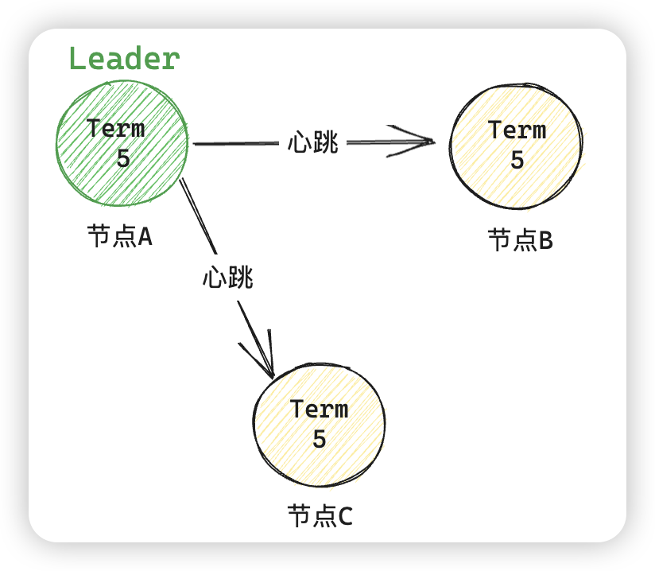
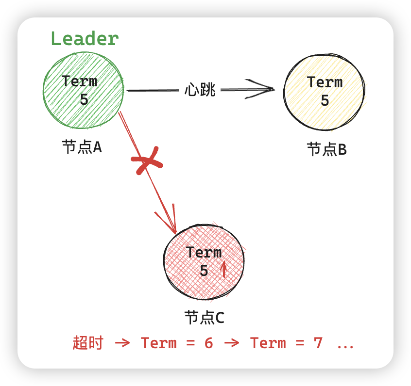
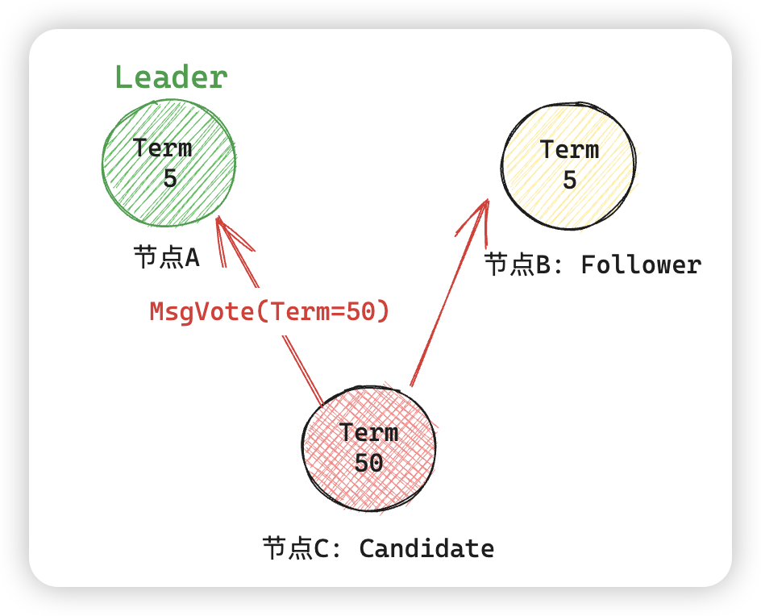
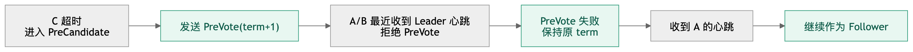
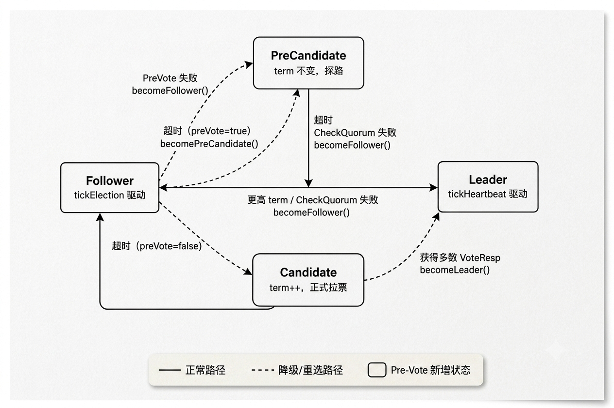

+++
date = '2026-06-16T17:00:00+08:00'
draft = false
title = 'Etcd Raft 02: PreVote 机制'
tags = ['etcd', '存储']
+++

# etcd Raft (二)：PreVote 机制

从这篇开始，我准备总结一些实际生产中的issue 和解决方案，这一篇主要聚焦于 Raft 选举中的 PreVote 机制。

在系统的介绍 PreVote 机制之前，需要先讲清楚这种机制解决了什么场景的问题。

## 1. 场景说明

假设现在我们有一个三节点的 etcd 集群，当前的任期 Term = 5。



当网络发生分区后，假设节点 C 与集群断开连接：





在网络恢复后，假设节点 C 自身的 Term 已经到了50，那么它就会向其他节点发送 Term = 50 的消息，然后节点 A 发现 C 的 Term 更大，因此 A 强制退位，导致整个集群进行新一轮选举，而这个期间，集群处于不可写状态。


这就是 etcd issue [#9333](https://github.com/etcd-io/etcd/issues/9333) 所描述的真实问题。etcd 维护者把这类节点叫做破坏性节点。那么在实际生产环境下，只要某个 etcd follower 的网络断开再恢复，就必然触发一次 leader 重选，Kubernetes 会因此抖动一下。

## 2. PreVote 的核心思想

为了解决这种场景带来的强制重新选举问题，就可以引入 PreVote 这种机制了，而这种机制的思想也比较简单：**先问问自己能不能赢**。

具体的做法就是：在真正自增 term、发起选举之前，先向其他节点问一句："如果我现在发起选举，你们会投票给我吗？"只有得到多数人的肯定答复，才真正开始选举。

上一篇文章其实提过 Raft 论文中有三种角色：

- Leader
- Follower
- Candidate

而在引入 PreVote 之后，为了描述 PreVote 阶段，实际的工程实现中会增加另外一种角色：**PreCandidate**。

在有了这个临时状态角色后，当节点 C 重新加入进群后，它只需要经历如下的步骤：



### 2.1 新的选举状态机

加入 PreVote 后，etcd raft 的状态机从论文的三态变成了四态：



PreCandidate 是一个纯粹的过渡态，它存在的唯一目标就是在不改变任何持久化状态的前提下，探测自己是否有赢得选举的可能性。如果探测失败，节点悄悄退回 Follower，整个集群对此毫无感知。

### 2.2 etcd PreVote 的实现

PreVote 涉及三段代码的协作：

- 触发入口
- 候选人侧行为
- 投票人侧判断

把这三段串起来，整个机制就清晰了，下面看看 etcd 怎么实现的。

> 注：本文使用的 etcd 版本代码为：v3.6.11

#### 2.2.1 触发入口

*核心：选举超时后先发起 PreVote*

入口在 `tickElection` 方法。当节点可被提升为 leader，且选举超时后，会给自己投递一个本地 MsgHup：

```go
  // vendor/go.etcd.io/raft/v3/raft.go:850
  func (r *raft) tickElection() {
  	r.electionElapsed++

  	if r.promotable() && r.pastElectionTimeout() {
  		r.electionElapsed = 0
  		if err := r.Step(pb.Message{From: r.id, Type: pb.MsgHup}); err != nil {
  			r.logger.Debugf("error occurred during election: %v", err)
  		}
  	}
  }
```

进一步，`Step(MsgHup)` 方法会根据 r.preVote 决定走预选举还是直接选举（其实就是一个配置了）：

```go
  // vendor/go.etcd.io/raft/v3/raft.go:1181
  case pb.MsgHup:
  	if r.preVote {
  		r.hup(campaignPreElection)
  	} else {
  		r.hup(campaignElection)
  	}
```

`hup` 做一些前置检查：比如不能是 leader 等等。通过后才调用 campaign：

```go
  // vendor/go.etcd.io/raft/v3/raft.go:973
  func (r *raft) hup(t CampaignType) {
  	if r.state == StateLeader {
  		return
  	}
  	if !r.promotable() {
  		return
  	}
  	if r.hasUnappliedConfChanges() {
  		return
  	}

  	r.campaign(t)
  }
```

#### 2.2.2 候选人侧行为

*核心：先成为 PreCandidate，不增加 term*

PreVote 的关键点是：节点进入 StatePreCandidate，但是不增加自己的 Term，也不写 Vote。

```go
  // vendor/go.etcd.io/raft/v3/raft.go:917
  func (r *raft) becomePreCandidate() {
  	if r.state == StateLeader {
  		panic("invalid transition [leader -> pre-candidate]")
  	}
  	// Becoming a pre-candidate changes our step functions and state,
  	// but doesn't change anything else. In particular it does not increase
  	// r.Term or change r.Vote.
  	r.step = stepCandidate
  	r.trk.ResetVotes()
  	r.tick = r.tickElection
  	r.lead = None
  	r.state = StatePreCandidate
  }
```

`campaign(campaignPreElection)` 会发送 MsgPreVote 给集群中其他的节点，消息里的 term 是 r.Term + 1，表示“如果我真的竞选，会用下一个 term”。但本地 r.Term 还没变。

```go
// vendor/go.etcd.io/raft/v3/raft.go:1025
  func (r *raft) campaign(t CampaignType) {
  	var term uint64
  	var voteMsg pb.MessageType
  	if t == campaignPreElection {
  		r.becomePreCandidate()
  		voteMsg = pb.MsgPreVote
  		// PreVote RPCs are sent for the next term before we've incremented r.Term.
  		term = r.Term + 1
  	} else {
  		r.becomeCandidate()
  		voteMsg = pb.MsgVote
  		term = r.Term
  	}

  	for _, id := range ids {
  		if id == r.id {
  			r.send(pb.Message{To: id, Term: term, Type: voteRespMsgType(voteMsg)})
  			continue
  		}
  		last := r.raftLog.lastEntryID()
  		r.send(pb.Message{
  			To: id, Term: term, Type: voteMsg,
  			Index: last.index, LogTerm: last.term,
  		})
  	}
  }
```

收到多数 MsgPreVoteResp 后，stepCandidate 会把预选举升级成正式选举：

```go
  // vendor/go.etcd.io/raft/v3/raft.go:1666
  func stepCandidate(r *raft, m pb.Message) error {
  	var myVoteRespType pb.MessageType
  	if r.state == StatePreCandidate {
  		myVoteRespType = pb.MsgPreVoteResp
  	} else {
  		myVoteRespType = pb.MsgVoteResp
  	}

  	switch m.Type {
  	case myVoteRespType:
  		gr, rj, res := r.poll(m.From, m.Type, !m.Reject)
  		switch res {
  		case quorum.VoteWon:
  			if r.state == StatePreCandidate {
  				r.campaign(campaignElection)
  			} else {
  				r.becomeLeader()
  				r.bcastAppend()
  			}
  		case quorum.VoteLost:
  			r.becomeFollower(r.Term, None)
  		}
  	}
  	return nil
  }
```

#### 2.2.3 投票人侧判断

*核心：可以预投票，但不因 PreVote 提升本地 term*

投票人收到 MsgPreVote 时，首先经过 `Step` 的 term 处理。这里最重要的是：

```go
// vendor/go.etcd.io/raft/v3/raft.go:1107
  case m.Type == pb.MsgPreVote:
  	// Never change our term in response to a PreVote
```

普通 MsgVote 带更高 term 会让接收方更新 term 并转 follower；真正是否投票在 MsgVote, MsgPreVote 的统一分支里:

```go
  // vendor/go.etcd.io/raft/v3/raft.go:1204
  case pb.MsgVote, pb.MsgPreVote:
  	canVote := r.Vote == m.From ||
  		(r.Vote == None && r.lead == None) ||
  		(m.Type == pb.MsgPreVote && m.Term > r.Term)

  	lastID := r.raftLog.lastEntryID()
  	candLastID := entryID{term: m.LogTerm, index: m.Index}
  	if canVote && r.raftLog.isUpToDate(candLastID) {
  		r.send(pb.Message{
  			To: m.From,
  			Term: m.Term,
  			Type: voteRespMsgType(m.Type),
  		})
  	} else {
  		r.send(pb.Message{
  			To: m.From,
  			Term: r.Term,
  			Type: voteRespMsgType(m.Type),
  			Reject: true,
  		})
  	}
```

判断条件可以拆成两类：

  1. 是否可以投：
     - 已经投给过这个节点；
     - 或者当前 term 还没投票且不知道 leader；
     - 或者消息是 MsgPreVote，且请求 term 是未来 term

  2. 候选人日志是否足够新：
     - r.raftLog.isUpToDate(candLastID)

  如果开启了 `CheckQuorum`，且当前 leader 租期还没有过期，还会直接忽略更高 term 的 MsgVote / MsgPreVote，避免在 leader 仍然活跃时被打扰：

```go
// vendor/go.etcd.io/raft/v3/raft.go:1093
  if m.Type == pb.MsgVote || m.Type == pb.MsgPreVote {
  	force := bytes.Equal(m.Context, []byte(campaignTransfer))
  	inLease := r.checkQuorum && r.lead != None && r.electionElapsed < r.electionTimeout
  	if !force && inLease {
  		return nil
  	}
  }
```

## 3. PreVote 为什么要和 CheckQuorum 一起看

在上面看源码的过程中，也能注意到 PreVote 和 CheckQuorum 机制还是存在关联的，但是严格上来说，它们约束的内容是不相同的：

1. PreVote 约束的是新加入集群的节点，当一个 follower 选举超时后，并不会立刻把自己的 term 加一并发起正式投票，而是先进入 `StatePreCandidate`，发送 `MsgPreVote` 探测自己是否可能拿到多数节点的支持。接收方即使看到 `MsgPreVote` 携带的是未来 term，也不会更新自己的本地 term。这样，一个被网络隔离的节点即使反复超时，也不会仅凭更高 term 干扰当前 leader。

2. CheckQuorum 约束的是现在的 leader：leader 会周期性检查自己是否还能和多数派通信；如果多数派不活跃，就主动退回 follower。同时，在 follower 侧，如果开启了 CheckQuorum，并且当前 leader lease 还没有过期，那么它会忽略普通的 `MsgVote` 和 `MsgPreVote` 请求。换句话说，只要 follower 最近还听到过 leader，它就不会轻易响应新的竞选者。

这两者配合使用的时候，选举就会变得更保守：

  - 少数派节点不会因为超时就抬高 term，扰乱多数派中的 leader；
  - 多数派中的 follower 在 leader lease 内不会响应新的竞选请求；
  - leader 如果失去多数派，也会通过 CheckQuorum 主动下台。


这种设计牺牲了一部分故障切换速度。因为正常的选举现在可能要先经历一轮 PreVote，再进入正式 Vote；如果 CheckQuorum 的 leader lease 尚未过期，新的竞选者还需要等待 lease 失效后才更容易拿到响应。但换来的好处是，集群在网络抖动、节点短暂隔离和旧节点重新加入时，不会轻易发生 term 膨胀和无意义的 leader 退位。


