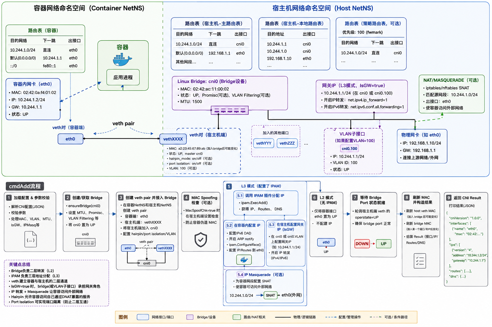
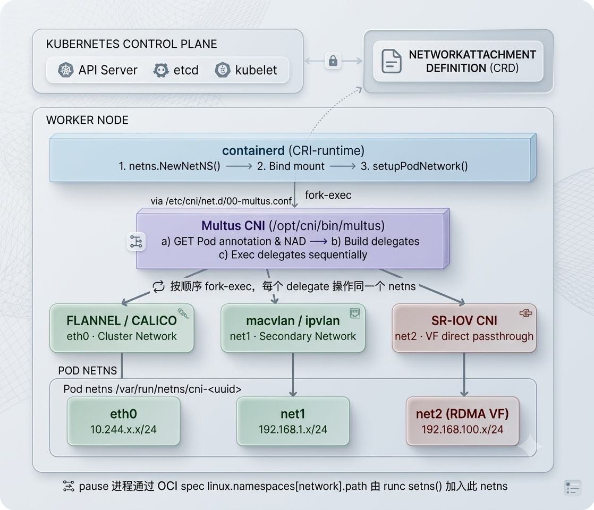
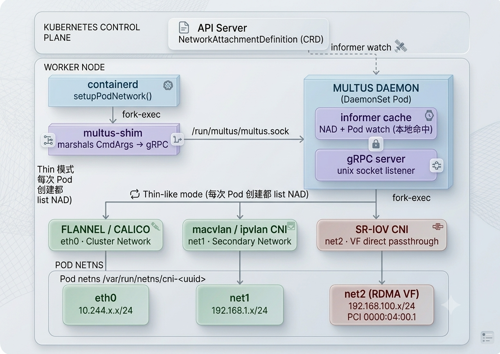

+++
date = '2026-06-11T16:50:00+08:00'
draft = false
title = 'K8s Multiple CNI Solution: Multus'
tags = ['LLM Infra', '网络', 'k8s']
+++

# 1. 为什么需要多网卡

传统微服务场景下，东西向网络流量通常不需要特别大的带宽，采用常规网卡即可满足需求。但在 AI 场景或其它高性能场景下，传统网卡就显得不够用了。因此，一种常见的做法是将流量分离：传统业务流量和管理流量依然走传统网卡，而其它流量走特定的网卡。然而，Kubernetes 默认的网络模型仅会给 Pod 分配一个网卡。要提供多网卡，必须有一种机制将不同的网卡设备也挂载到 Pod 的网络命名空间（netns）中。实现这种效果需要使用多 CNI，目前工业界普遍采用的成熟开源方案是 **Multus**。

# 2. CNI 基础原理

要想了解 Multus CNI 是如何在现有 CNI 机制上进行扩展的，需要先简单了解相关的背景知识和 CNI 的基础内容。

## 2.1 netns 网络命名空间

Linux 会把网络虚拟化成独立的 netns。每个 netns 拥有独立的：

- 网络接口列表
- 路由表
- iptables 规则链
- socket 表
- /proc/sys/net/ 参数

网络接口/设备可以在 netns 之间移动（通过 `ip link set eth0 netns <pid>`），但移动后原 netns 就看不到它了。veth pair 是例外——veth 是成对创建的，一端在 host netns，一端在 Pod netns，两端之间形成一条虚拟以太网链路，这样 Pod 即可正常发送和接收数据包。

需要特别说明的是：netns 的生命周期绑定到"至少有一个引用"。意思是说，只要某个进程打开了 `/proc/<pid>/ns/net` 这个文件，就持有了一个引用，即使进程退出，netns 也不会消亡（直到文件被关闭）。kubelet 把这个文件路径传给 CNI 二进制文件，就是为了让 CNI 能用 `setns(fd, CLONE_NEWNET)` 系统调用进入那个 netns 配置接口。

## 2.2 哪个容器持有 netns

根据 Kubernetes 网络模式的规定，一个 Pod 内的所有容器共享同一个 netns，该 netns 由 **pause 容器** 持有。实现流程如下：

1. kubelet 启动 Pod 时，通过 runtimeService（基于 gRPC）调用 CRI 的 `RunPodSandbox` 方法。
2. CRI 收到请求后，在 `RunPodSandbox` 中继续调用 `netns.NewNetNS` 创建一个空的 netns，然后将这个文件 bind mount 到 `/var/run/netns/cni-xxxxxx`（Docker 环境为 `/run/docker/netns/xxxxxx`）。此时尚未有任何进程属于这个 netns。（关于创建 netns 的详细步骤请移步补充内容。）
3. CRI 进一步调用 `setupPodNetwork()`，在这里调用 CNI 二进制文件，在这个空 netns 里配置网络。CNI 执行完成后退出，netns 中已有了网络接口（eth0）、IP 和路由。
4. 最后，CRI 调用 `StartSandbox()`，真正创建并启动 pause 容器。pause 通过 OCI spec 加入已存在的 netns。后续业务容器启动时也通过同样的方式加入这个 netns。

## 2.3 如何给 Pod 分配接口/IP 等内容

CRI runtime 在启动 Pod sandbox 时，会通过 CNI library 调用本地 CNI 插件。它通常会扫描 `/etc/cni/net.d/` 下的 CNI 配置文件（例如 Calico 常见的 `10-calico.conflist`）。文件名前面的数字决定加载顺序，数字越小越靠前。

配置文件中的 `type` 字段会对应到 `/opt/cni/bin/` 下的 CNI 插件二进制文件。CNI library 会在该目录中查找可执行文件，然后通过执行插件 binary，并借助环境变量和 stdin 封装一个 `cmdAdd` 的入参，调用 `cmdAdd` 方法来完成 Pod 网络接口、IP、路由等配置。

以 bridge CNI 搭配 host-local IPAM 为例，配置文件示例如下：

```json
{
    "cniVersion": "1.0.0",
    "name": "mynet",
    "type": "bridge",
    "bridge": "mynet0",
    "isDefaultGateway": true,
    "forceAddress": false,
    "ipMasq": true,
    "hairpinMode": true,
    "ipam": {
        "type": "host-local",
        "subnet": "10.10.0.0/16"
    }
}
```

### 2.3.1 CNI 插件收到什么？

`cmdAdd` 的入参 `*skel.CmdArgs` 结构如下：

```go
type CmdArgs struct {
    ContainerID   string // 容器 ID
    Netns         string // 要加入的那个 netns
    IfName        string // 给容器添加的设备名字，例如 eth0
    Args          string
    Path          string
    NetnsOverride string
    StdinData     []byte // CNI 配置（JSON）
}
```

插件要做的事只有一件：在 `Netns` 这个 netns 里，用 `IfName` 这个名字，创建一张有 IP 的网络接口。

### 2.3.2 创建设备并分配 IP

该插件在上述流程中主要完成以下几个步骤：

1. 解析配置并在宿主机上建立 bridge 设备（或确保其存在）。
2. 打开 netns，创建 veth 对。
3. 如果有 IPAM，调用 IPAM 子插件分配 IP。
4. 进入容器 netns，配置 IP 和路由。

首先，bridge 插件在 host netns 里用 `netlink.LinkAdd` 确保 bridge 存在（已存在则复用），并把 bridge 状态设为 UP。

然后，CNI 会调用 `setupVeth` 方法，在容器网络命名空间和宿主机网络命名空间之间创建 veth 对：
- 容器端：`args.IfName`（如 `eth0`）
- 宿主机端：自动生成临时名字（如 `vethxxx`）

接着将宿主机端的 veth 接入 bridge，并配置：
- Hairpin 模式（允许容器访问自己通过 DNAT 暴露的服务）
- 端口隔离
- VLAN 标签（如果配置了 VLAN）

如果 CNI 配置中包含 IPAM，则进入 L3 模式，通过 IPAM 分配 IP 并配置网络，具体步骤为：
- 向 IPAM 请求 IP 地址，拿到 IP 和网关地址。
- 补全网关地址并配置默认路由。
- 进入容器 namespace 配置网卡，开启 ARP notify，然后将 IP、网关等写到容器内的网卡设备上。这一步类似于在容器内执行：
  ```bash
  ip addr add 10.244.1.5/24 dev eth0
  ip route add default via 10.244.1.1
  ```
- 在宿主机上给 bridge 配置网关 IP，并开启 IP 转发。
- 配置 IP Masquerade（SNAT）。



## 2.4 Pod 单网卡的限制从哪儿来？

前面提到，CRI runtime 通过 go-cni 库调用 CNI 插件。go-cni 在初始化时会扫描 `/etc/cni/net.d/` 目录下的配置文件，并决定要加载几个网络。**单网卡的限制就发生在这个加载逻辑中。**

来看 containerd 的 go-cni 库中的关键函数 `loadFromConfDir`（简化版）：

```go
func loadFromConfDir(c *libcni, maxConfigs int) error {
    // 1. 读取目录下所有 .conf / .conflist 文件
    files, _ := cnilibrary.ConfFiles(c.pluginConfDir, []string{".conf", ".conflist", ".json"})
    sort.Strings(files)  // 按字典序排序

    var networks []*Network
    for _, confFile := range files {
        // 解析配置文件为 NetworkConfigList
        confList := parse(confFile)
        networks = append(networks, &Network{config: confList})
        if len(networks) == maxConfigs {
            break   // 达到上限就停止
        }
    }
    c.networks = networks
    return nil
}
```

所有文件都会被遍历解析，但受 `maxConfigs` 控制，达到上限即 `break`。containerd 的默认配置是 `cni_max_conf_num = 1`，对应 `maxConfigs = 1`，因此实际上只加载字典序第一个文件对应的网络。

由此可见，单网卡的限制根源在于 **`maxConfigs = 1`**，这意味着 `c.networks` 里默认只有一条记录，`Setup()` 只会调用这一个网络插件，自然只能产生一张接口。

为了让 Pod 在自己的网络命名空间中看到多个网络接口，Multus 的方案是：**把自己变成那个"字典序第一"的 CNI 配置**，由 Multus 在内部调用多个 delegate CNI，从而绕过 go-cni 的最大配置数限制。

# 3. Multus 详解

Multus 的定位是一个 **meta-plugin**。它本身不创建任何网络设备，只负责按顺序调用多个 delegate CNI，并把结果都注入同一个 netns。对 CRI runtime 而言，它只调用了一个 CNI；对 Pod 而言，netns 里出现了来自不同 delegate 的多张接口。

## 3.1 部署形态

1. **Thin plugin（传统方式）**

   如下图所示，CRI runtime 每次 fork-exec `/opt/cni/bin/multus`，Multus 进程内部再 fork-exec 各个 delegate binary，执行完成后全部退出。这些进程的生命周期很短，每次 Pod 创建都要冷启动一个 in-cluster Kubernetes client，在 Pod 密集创建场景下会给 API Server 带来大量 list 请求。

   

2. **Thick plugin / DaemonSet（生产常用）**

   这种模式下，每个 Kubernetes 节点上常驻一个 `multus-daemon` 进程（DaemonSet），它持有完整的 Kubernetes informer cache，监听 `/run/multus/multus.sock`。CRI runtime fork-exec `multus-shim`，shim 将 `CmdArgs` 序列化后发给 daemon，daemon 处理完成返回结果。informer cache 消除了重复 list 的问题，同时 daemon 支持热加载 NAD 变更，无需重启。

   

## 3.2 数据模型

Multus 的数据模型由 **CRD**、**Pod 注解**以及**委托配置**三部分组成：

- **[NetworkAttachmentDefinition（NAD）](https://github.com/k8snetworkplumbingwg/network-attachment-definition-client) CRD**：用来描述一个附加网络的配置。
- **Pod 注解**（根据用处分为两类）：
  1. 选择附加网络：`k8s.v1.cni.cncf.io/networks` 注解可以让 Pod 声明需要使用的附加网络（可指定多个，以列表形式表示）。
  2. 状态回写：添加附加网络成功后，Multus 会将实际结果写回到 Pod 的 `k8s.v1.cni.cncf.io/networks-status` 注解，内容是一个 JSON 数组，记录每个接口的详细信息。
- **委托配置**：Multus 自身的主配置中，可以通过 `delegates` 字段指定默认网络插件（通常创建 eth0）。例如，将 flannel 作为主网络：

  ```json
  {
      "cniVersion": "0.3.1",
      "name": "multus-cni",
      "type": "multus",
      "delegates": [{
        "cniVersion": "0.3.1",
        "type": "flannel",
        ...
      }],
      "kubeconfig": "/etc/cni/net.d/multus.d/multus.kubeconfig"
  }
  ```

## 3.3 Multus 的调用流程：CmdAdd 全链路

前文已经讲述过 CNI 最终调用 `cmdAdd` 方法来配置 Pod 网络。当 Multus 被调用起来后也是一样的。根据 [Multus 源码](https://github.com/k8snetworkplumbingwg/multus-cni/blob/master/pkg/multus/multus.go#L743)，可以将整个 `CmdAdd` 分为 8 个部分。

### 3.3.1 加载 Multus 自身的配置与环境参数

Multus 从 stdin 拿到自己的主配置，其中 `delegates` 字段里藏着默认网络插件（例如 flannel 或 calico）的配置：

```go
n, err := types.LoadNetConf(args.StdinData)
if err != nil {
    return nil, cmdErr(nil, "error loading netconf: %v", err)
}
```

随后从环境变量提取 Kubernetes 参数（Pod 名字、命名空间等），这些会被塞进 `k8sArgs` 里，贯穿整个流程：

```go
k8sArgs, err := k8s.GetK8sArgs(args)
```

此时 `n.Delegates` 已经包含了默认网络配置（如果配置了的话），但附加网络还没着落。

### 3.3.2 获取 Pod 对象

Multus 需要 Pod 对象来读取注解，于是调用 `GetPod`：它先用 informer 缓存，若失败就退回到 API 直接查询，并且在 Pod 未找到时对 ADD 操作采取容忍策略（返回空结果，避免卡住 kubelet）：

```go
pod, err := GetPod(kubeClient, k8sArgs, false)
if err != nil {
    if stderrors.Is(err, errPodNotFound) {
        emptyResult := emptyCNIResult(args, n.CNIVersion)
        return emptyResult, nil
    }
    return nil, err
}
```

若 Pod 已被删除，Multus 直接返回一个带有 `0.0.0.0` 的空结果，让 kubelet 继续后续流程。

### 3.3.3 加载委托网络列表

`k8s.TryLoadPodDelegates` 是附加网络的"真相时刻"。它会解析 Pod 的 `k8s.v1.cni.cncf.io/networks` 注解，把每一项转换成内部的数据结构 `DelegateNetConf`，追加到 `n.Delegates` 里。如果注解引用了 CRD，就去缓存里把对应配置取出来并填充进去：

```go
_, kc, err := k8s.TryLoadPodDelegates(pod, n, kubeClient, resourceMap)
if err != nil {
    return nil, cmdErr(k8sArgs, "error loading k8s delegates k8s args: %v", err)
}
```

这里的 `kc` 代表 Kubernetes 客户端可用（有 kubeconfig），后续写网络状态时会用到。此时 `n.Delegates` 已经是一个完整有序的列表：**默认网络 + 附加网络1 + 附加网络2 + ...**。这个顺序决定了接口命名。

### 3.3.4 缓存委托配置

为了防止 Pod 被快速删除时 `CmdDel` 拿不到委托信息，Multus 会把整个 `n.Delegates` 序列化并写入磁盘：

```go
if err := saveDelegates(args.ContainerID, n.CNIDir, n.Delegates); err != nil {
    return nil, cmdErr(k8sArgs, "error saving the delegates: %v", err)
}
```

这样即便 Pod 被删、注解丢失，DEL 操作仍然可以从缓存中恢复委托配置，安全地清理网络接口。

### 3.3.5 循环委托，逐个添加网络

这是核心逻辑。每个委托都会获得一个网络接口名，然后调用 `DelegateAdd` 执行真正的 CNI ADD：

```go
for idx, delegate := range n.Delegates {
    ifName := getIfname(delegate, args.IfName, idx)
    rt, _ := types.CreateCNIRuntimeConf(args, k8sArgs, ifName, n.RuntimeConfig, delegate)
    tmpResult, err = DelegateAdd(exec, kubeClient, pod, delegate, rt, n)
    // ...
}
```

其中，`getIfname` 的逻辑保证了接口名的确定性和可预测性：

```go
func getIfname(delegate *types.DelegateNetConf, argif string, idx int) string {
    if delegate.IfnameRequest != "" {
        return delegate.IfnameRequest
    }
    if delegate.MasterPlugin {
        return argif  // 主网络使用 eth0
    }
    return fmt.Sprintf("net%d", idx) // 附加网络 net1, net2, ...
}
```

### 3.3.6 委托插件执行与路由策略

`DelegateAdd` 最终调用 `confAdd` 或 `conflistAdd`，它们会通过标准 CNI 路径找到插件二进制文件并执行，然后把返回的结果（IP、路由、DNS）收集起来。

除此之外，代码中还有一个非常实用的功能：**按需删除或替换默认网关**。

如果某个附加网络标注了 `default-route` 选择器（通过注解配置），Multus 会在 ADD 之后手动删除该接口的默认路由，或者用它指定的网关替换：

```go
if deleteV4gateway || deleteV6gateway {
    err = netutils.DeleteDefaultGW(args.Netns, ifName)
    // ...
}
if adddefaultgateway {
    err = netutils.SetDefaultGW(args.Netns, ifName, *delegate.GatewayRequest)
    // ...
}
```

这使得多网卡场景下的路由控制非常灵活。

### 3.3.7 汇总结果，回写 Pod 状态

所有委托成功后，Multus 会从每个结果中提取 IP 和接口信息，拼装成 `NetworkStatus` 切片，然后通过 API 写入 Pod 的 `k8s.v1.cni.cncf.io/networks-status` 注解：

```go
if kubeClient != nil && kc != nil {
    err = k8s.SetNetworkStatus(kubeClient, k8sArgs, netStatus, n)
    // ...
}
```

这样其他组件（例如监控、策略引擎）就能直接读到 Pod 的多网卡分配情况。最终，Multus 把主网络的结果（eth0 的 IP 和路由）作为整个 `CmdAdd` 的返回值交给 kubelet。

### 3.3.8 失败回滚

如果在添加第 N 个委托时失败，Multus 会立即停止后续委托，并调用 `delPlugins` 回滚已添加的前 N-1 个接口：

```go
tmpResult, err = DelegateAdd(...)
if err != nil {
    _ = delPlugins(exec, nil, args, k8sArgs, n.Delegates, idx, n.RuntimeConfig, n)
    return nil, cmdPluginErr(k8sArgs, netName, "error adding container to network %q: %v", netName, err)
}
```

`delPlugins` 会以倒序方式对每个已添加的委托调用 `DelegateDel`，保证网络命名空间里不留下任何残留。这种"全成功或全失败"的原子性，是生产环境中 Pod 创建可靠性的重要保障。


# 4. 总结

总结一下，Kubernetes 默认只给 Pod 一张网卡，这在 AI 这类高性能场景下不够用。

Multus 的思路很直接：它把自己伪装成默认 CNI，然后在内部偷偷调起多个网络插件，让 Pod 能同时挂上多张网卡。

这篇文章讲了一些 CNI 的基础内容，分析了单网卡的根源，然后聊了 Multus 的工作方式和几种部署形态，也算是给网络这类文章开个头。


## 补充内容

### 1. netns 创建过程

containerd 在创建 netns 时会执行以下操作：

1. 创建用于挂载点的文件（非目录），随机命名如 `cni-xxxx`。
2. 通过 bind mount 实现持久化：`mount(/proc/pid/ns/net, 文件, MS_BIND)`，增加引用计数，使得进程退出后命名空间依然存活。
3. 创建新 netns：`unshare(CLONE_NEWNET)` 在线程级完成。
4. 必须调用 `LockOSThread`：因为 netns 是线程属性，锁定专用线程可避免污染其他调用方。
5. 使用完毕后切回原 netns。
